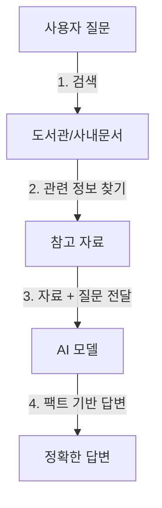

# AI 에이전트 시대의 핵심 요약 (2025년 12월 기준)

## 1. 전공자/엔지니어용 요약 (The AI Architect)

### 1.1. 핵심 현황: "API 호출자"에서 "AI 아키텍트"로의 전환
현재 AI 시장은 단순한 프롬프트 엔지니어링을 넘어, **비용-성능-정확도(Cost-Performance-Accuracy)** 트라이앵글을 최적화하는 시스템 설계 단계로 진입했습니다. 범용 거대 모델(GPT-4 등) 만능주의가 끝나고, 도메인 특화 경량 모델(SLM)과 RAG의 결합이 표준이 되었습니다.

### 1.2. LLM의 구조적 한계 (Why RAG is Essential for Knowledge Tasks)
LLM은 본질적으로 '확률적 텍스트 생성기'이며, 지식 기반 업무에서 다음과 같은 한계를 가집니다.

*   **Hallucination (환각)**: Next Token Prediction 방식의 태생적 한계로, 사실이 아닌 정보를 그럴듯하게 생성.
*   **Attention Decay & Lost in the Middle**: Context Window가 아무리 커져도(128k+), 문서 중간 부분의 정보를 망각하는 U자형 정보 손실 발생.
*   **Knowledge Cutoff (지식 단절)**: 학습 시점 이후의 최신 데이터 반영 불가.

### 1.3. 해결책: RAG (Retrieval-Augmented Generation) 아키텍처
지식 기반 답변이 필요한 경우, **검색(Retrieval)**과 **생성(Generation)**을 분리하여 정확도를 극대화하는 RAG가 표준 접근 방식입니다.

**[RAG 아키텍처 다이어그램]**
```mermaid
graph LR
    A[User Query] --> B{Hybrid Search};
    B -->|Keyword| C[BM25 / Splade];
    B -->|Semantic| D[Vector DB];
    C & D --> E[Re-ranking (Cross-Encoder)];
    E --> F[Top-K Context];
    F --> G[LLM Generation];
    G --> H[Final Answer];
```

*   **Vector DB & Embedding**: 텍스트를 고차원 벡터(Dense Vector)로 변환하여 의미 기반 검색 수행 (HNSW 인덱싱 등 활용).
*   **Advanced RAG Techniques**:
    *   **Hybrid Search**: 키워드 검색(BM25) + 시맨틱 검색의 결합.
    *   **Re-ranking**: 검색된 문서들의 순위를 Cross-Encoder 모델로 재조정하여 정확도 향상.
    *   **Chunking Strategy**: 문서 구조(Semantic)에 맞춘 데이터 분할 최적화.

### 1.4. 최신 아키텍처 트렌드
*   **Beyond Transformer (Mamba)**: 기존 Transformer의 $O(n^2)$ 복잡도 문제를 해결하는 **SSM(State Space Model)** 기반 아키텍처. $O(n)$ 선형 복잡도로 긴 시퀀스 처리에 효율적이나, 아직은 **초기 단계(Early-stage)**이며 Transformer를 완전히 대체하기보다 상호 보완적인 관계로 발전 중입니다.
*   **MCP (Model Context Protocol)**: AI 모델이 외부 데이터, 도구, 리소스와 상호작용하기 위한 **Client-Server 표준 프로토콜**. 시스템 간의 상호운용성(Interoperability)을 보장하여, 에이전트가 다양한 도구를 표준화된 방식으로 사용할 수 있게 합니다.
*   **Agentic Workflow**: 단일 LLM이 아닌, 특정 역할(기획, 코딩, 리뷰)을 가진 멀티 에이전트가 협업하여 복잡한 과업 수행.

---

## 2. 비전공자/일반인용 요약 (AI Literacy)

### 2.1. 현재 상황: "채팅"을 넘어 "일하는 AI"로
AI가 단순히 말을 잘하는 '챗봇' 단계를 지났습니다. 이제는 회사 내부 문서를 보고 업무를 처리하거나, 엑셀/PPT를 다루는 **'실무형 에이전트'**로 진화하고 있습니다. 중요한 건 "AI를 쓸 줄 아는가"를 넘어 "AI에게 일을 제대로 시키는 원리를 아는가"입니다.

### 2.2. 왜 AI는 거짓말을 하고, RAG가 필요한가?
AI(LLM)는 '똑똑한 암기왕'이라기보다 **'글짓기 선수'**에 가깝습니다. 창작은 잘하지만 팩트 전달에는 약점이 있습니다.

*   **문제점 (LLM의 한계)**:
    *   **모르면 지어낸다 (환각)**: 팩트 체크 없이 그럴듯한 문장을 만듭니다.
    *   **건망증 (기억력 한계)**: 너무 긴 문서를 주면 앞부분 내용을 까먹습니다.
    *   **최신 정보 부재**: 오늘 아침 뉴스나, 우리 회사의 비공개 회의록은 모릅니다.

*   **해결책 (RAG: 오픈북 테스트)**:
    *   AI에게 "그냥 외워서 답해"라고 하는 대신, **"이 참고서(데이터베이스)를 보고 답해"**라고 시키는 기술입니다.
    *   이것이 바로 **RAG(검색 증강 생성)**입니다. 지식이 필요한 업무에서는 필수적입니다.

**[개념 시각화]**


### 2.3. 실무 적용 포인트
1.  **비용 절감**: 비싼 최신 AI(GPT-4 등)를 무조건 쓰는 게 아니라, 용도에 맞는 '가성비 AI'를 골라 쓰는 능력이 중요합니다.
2.  **데이터 준비**: AI가 잘 이해할 수 있도록 우리 회사의 문서를 정리(데이터 전처리)하는 것이 핵심 경쟁력입니다.
3.  **표준화된 연결 (MCP)**: 다양한 AI 도구와 우리 회사의 데이터를 **표준화된 방식(MCP)**으로 연결하여, 레고 블록처럼 쉽게 시스템을 확장할 수 있습니다.

### 2.4. 결론
미래의 인재는 AI에게 "질문하는 사람"이 아니라, **AI가 일할 수 있는 "환경(데이터, 시스템)을 설계하는 사람"**입니다. AI 기술의 내부를 이해해야만 비용 폭탄을 피하고, 남들보다 빠르고 정확한 업무 시스템을 구축할 수 있습니다.
