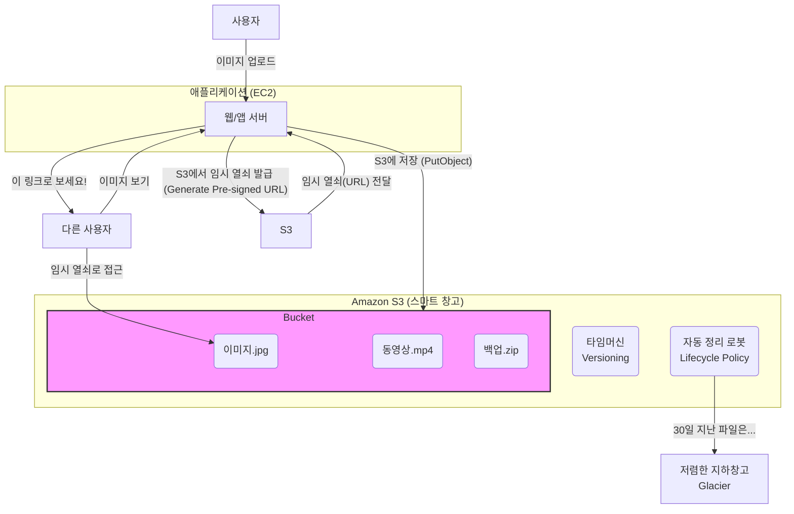

# Step 4: S3 객체 스토리지

## 학습 목표

기존 파일 시스템(File System)과는 다른 패러다임인 객체 스토리지(Object Storage)의 특성을 이해하고, 사실상 무한한 확장성과 내구성, 다양한 기능을 제공하는 Amazon S3를 활용하여 데이터를 효과적으로 저장, 보호, 관리하는 방법을 학습합니다.

---

## 1. 핵심 개념 (Professional's View)

-   **Object Storage vs. File/Block Storage**:
    -   **File Storage (NAS)**: 계층적인 디렉토리 구조로 데이터를 관리. 파일 단위 접근.
    -   **Block Storage (SAN, EBS)**: 데이터를 고정된 크기의 블록으로 나누어 저장. OS가 파일 시스템을 통해 접근하며, 고성능의 데이터베이스 등에 사용.
    -   **Object Storage (S3)**: 데이터를 '객체(Object)' 단위로 저장. 각 객체는 데이터, 고유 ID(Key), 그리고 풍부한 메타데이터로 구성. 계층 구조 없이 평면적인 주소 공간(Flat address space)을 가지며, HTTP/S API를 통해 접근. 대규모 비정형 데이터 저장에 최적화.

-   **S3 (Simple Storage Service)**:
    -   **Buckets & Objects**: 데이터는 객체(Object)로 저장되며, 이 객체들은 전 세계적으로 고유한 이름을 가진 버킷(Bucket)에 보관됩니다.
    -   **Durability & Availability**: S3 Standard는 `99.999999999%` (eleven 9s)의 내구성을 제공하도록 설계되었습니다. 이는 여러 가용 영역(AZ)에 객체를 자동으로 복제하여 저장하기 때문에 가능합니다. 가용성은 스토리지 클래스에 따라 다릅니다 (예: S3 Standard는 `99.99%`).
    -   **Storage Classes**: 데이터의 접근 빈도와 보존 기간에 따라 비용을 최적화할 수 있도록 다양한 스토리지 클래스를 제공합니다. (S3 Standard, S3 Intelligent-Tiering, S3 Standard-IA, S3 Glacier Instant Retrieval, S3 Glacier Flexible Retrieval, S3 Glacier Deep Archive 등)
    -   **Versioning**: 버킷에 저장된 모든 객체의 모든 버전을 보존, 검색 및 복원하는 기능. 실수로 인한 삭제나 덮어쓰기로부터 데이터를 보호하는 핵심적인 안전장치입니다.
    -   **Lifecycle Policies**: 객체의 수명 주기를 관리하는 자동화된 규칙. 예를 들어, "생성 후 30일이 지난 객체는 S3 Standard-IA로 옮기고, 180일이 지나면 Glacier로 옮긴 후, 365일이 지나면 영구 삭제하라"와 같은 규칙을 설정하여 비용을 최적화할 수 있습니다.
    -   **Security**: 기본적으로 모든 버킷과 객체는 비공개(Private)입니다. IAM 정책, 버킷 정책, ACL, 그리고 S3 Block Public Access 기능을 통해 세분화된 접근 제어가 가능합니다. 데이터 전송 중 암호화(SSL/TLS)와 저장 시 암호화(SSE-S3, SSE-KMS, SSE-C)를 지원합니다.
    -   **Pre-signed URLs**: 제한된 시간 동안 특정 객체에 대한 임시 접근 권한을 부여하는 URL. 비공개 객체를 안전하게 공유하는 데 사용됩니다.

---

## 2. 쉬운 비유 (Beginner's View)

-   **S3**는 **마법 같은 '무한 용량의 스마트 창고'** 입니다.
-   **버킷(Bucket)**은 이 창고 안에 있는 **나만의 '보관함'** 입니다. 이 보관함 이름은 전 세계에서 유일해야 합니다.
-   **객체(Object)**는 보관함에 넣는 **'물건(파일)'** 하나하나입니다.
-   **내구성 (Durability)**: 내 물건을 보관함에 넣는 순간, S3가 마법을 부려 **똑같은 물건을 여러 비밀 장소에 복제**해 둡니다. 그래서 한 장소가 불타 없어져도 내 물건은 절대 사라지지 않습니다. (1년 동안 1억 개의 파일을 저장했을 때, 그중 1개가 사라질까 말까 한 확률)
-   **버저닝 (Versioning)**: **'되돌리기' 기능이 있는 타임머신**. 내가 실수로 물건을 부수거나 다른 물건으로 바꿔치기해도, "어제 상태로 되돌려줘!" 라고 외치면 원래대로 복구됩니다.
-   **수명 주기 정책 (Lifecycle Policy)**: **'자동 정리 로봇'**. "이 보관함에 넣은 물건 중, 한 달 동안 아무도 안 찾은 물건은 저렴한 지하 창고로 옮겨" 라고 규칙을 정해두면 로봇이 알아서 정리해주어 창고비를 아낄 수 있습니다.
-   **Pre-signed URL**: **'암호와 유효시간이 정해진 임시 열쇠'**. 내 보관함의 비공개 물건을 친구에게 딱 10분 동안만 보여주고 싶을 때, 이 임시 열쇠(URL)를 만들어 주면 됩니다. 10분이 지나면 열쇠는 쓸모없어집니다.

---

## 3. 시각화 (Architecture)

---

## 4. 나쁜 예시 (Bad Practice)

### 버킷을 Public으로 열어두고 모든 데이터를 저장
-   **상황**: 개발 편의성을 위해 S3 버킷을 인터넷에 전체 공개(`public-read`)하고, 사용자 프로필 이미지, 개인 문서, 시스템 로그 등 모든 파일을 그곳에 업로드했습니다.
-   **문제점**:
    -   **데이터 유출 (Data Breach)**: 버킷의 URL만 알면 누구나 민감한 정보에 접근할 수 있습니다. 이는 심각한 개인정보보호법 위반 및 기업 신뢰도 하락으로 이어집니다.
    -   **비용 폭탄 (Bill Shock)**: 악의적인 사용자가 대용량 파일을 무한정 다운로드하면 막대한 데이터 전송 비용이 청구될 수 있습니다.

---

## 5. 좋은 예시 (Good Practice)

### 기본 비공개 원칙 및 Pre-signed URL을 통한 접근 제어
-   **프로세스**:
    1.  **Block Public Access**: 버킷 생성 시, 모든 퍼블릭 액세스 차단 옵션을 활성화하여 버킷이 실수로라도 공개되는 것을 원천적으로 막습니다.
    2.  **파일 업로드**: 사용자가 애플리케이션을 통해 파일을 업로드하면, 애플리케이션 서버(EC2)는 IAM Role을 통해 S3 버킷에 파일을 안전하게 저장합니다.
    3.  **파일 다운로드**: 다른 사용자가 해당 파일을 보려고 할 때, 애플리케이션 서버는 **Pre-signed URL**을 생성하여 사용자에게 전달합니다. 이 URL은 짧은 만료 시간(예: 5분)을 가지며, 사용자는 이 URL을 통해 S3로부터 직접 파일을 안전하게 다운로드받습니다.
-   **개선점**:
    -   **보안**: 데이터는 항상 비공개로 유지되며, 접근은 애플리케이션의 비즈니스 로직을 통해서만 제어됩니다. 인증된 사용자에게만 제한된 시간 동안 접근이 허용됩니다.
    -   **성능**: 사용자가 S3로부터 직접 파일을 다운로드하므로, 애플리케이션 서버의 부하를 줄일 수 있습니다. (서버가 파일을 읽어서 다시 사용자에게 전달할 필요 없음)

---

## 6. 핵심 학습 포인트

-   **S3는 파일 서버가 아니다**: S3는 HTTP/S API로 접근하는 객체 스토리지입니다. 파일 시스템처럼 마운트하여 사용하는 것이 아니며, 그에 맞는 아키텍처 설계가 필요합니다.
-   **보안은 기본, 공개는 예외**: 모든 S3 버킷은 기본적으로 비공개여야 합니다. 정적 웹사이트 호스팅과 같이 명확한 목적이 있을 때만 버킷 정책을 통해 제한적으로 공개해야 합니다.
-   **비용과 성능의 균형**: 모든 데이터를 가장 비싼 S3 Standard에 보관할 필요는 없습니다. 데이터의 접근 패턴을 분석하고 수명 주기 정책(Lifecycle Policies)을 적극적으로 활용하여 스토리지 비용을 최적화해야 합니다.
-   **S3는 단순 스토리지가 아닌 플랫폼**: S3는 데이터 저장소 역할을 넘어, 데이터 처리(Lambda 연동), 정적 웹 호스팅, 데이터 분석(Athena) 등 다양한 AWS 서비스와 연동되는 강력한 플랫폼입니다.
