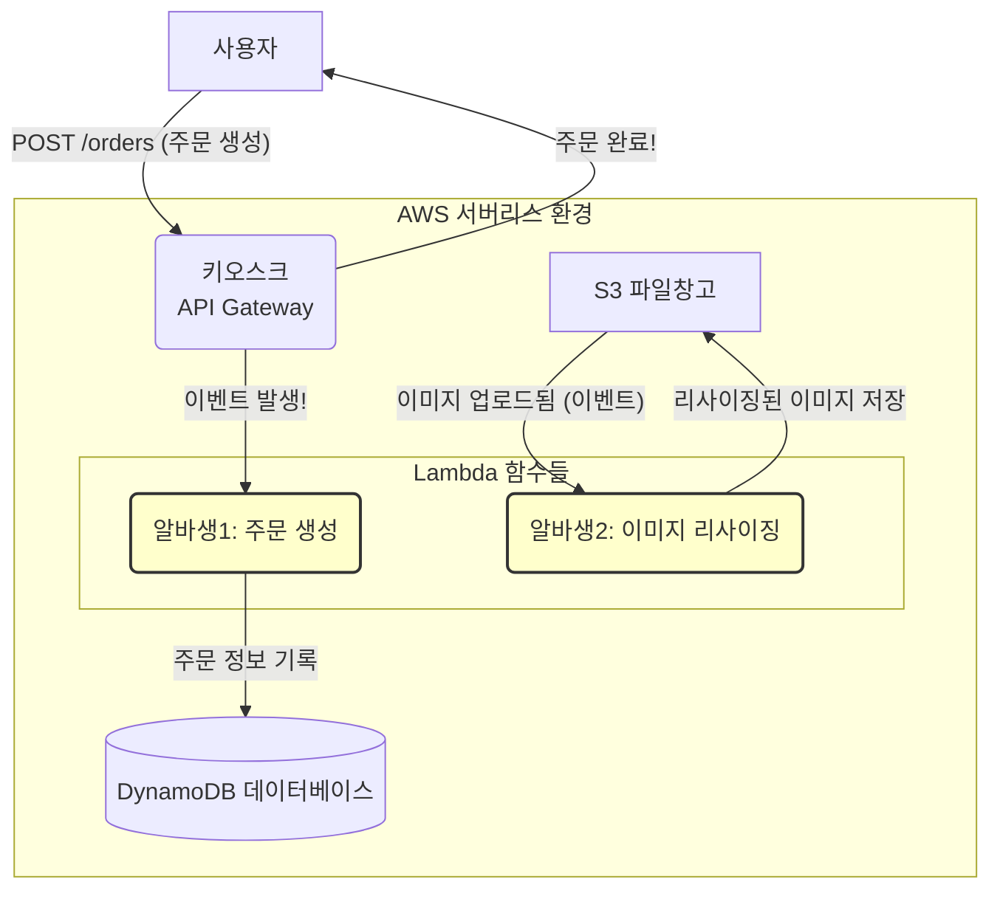

# Step 5: 서버리스 컴퓨팅 (Lambda)

## 학습 목표

서버 프로비저닝 및 관리의 부담 없이 코드를 실행하는 서버리스 아키텍처의 핵심인 AWS Lambda를 이해합니다. 이벤트 기반(Event-driven) 동작 모델을 학습하고, API Gateway와 연동하여 확장성과 비용 효율성이 뛰어난 서버리스 API를 구축합니다.

---

## 1. 핵심 개념 (Professional's View)

-   **Serverless Computing**: 개발자가 서버의 존재를 의식할 필요 없이 애플리케이션을 빌드하고 실행할 수 있는 클라우드 컴퓨팅 실행 모델. AWS가 인프라 프로비저닝, 패치, 확장, 관리를 모두 처리하며, 사용자는 실제 사용량에 대해서만 비용을 지불합니다. (FaaS, Function-as-a-Service)

-   **AWS Lambda**: 이벤트에 대한 응답으로 코드를 실행하는 컴퓨팅 서비스.
    -   **Event Source**: Lambda 함수를 트리거하는 AWS 서비스 또는 커스텀 애플리케이션 (예: API Gateway, S3, DynamoDB Streams, SQS).
    -   **Execution Environment**: 함수 실행을 위한 격리된 런타임 환경. Lambda는 필요 시 이 환경을 동적으로 생성, 관리, 파기합니다.
    -   **Concurrency & Scaling**: Lambda는 들어오는 이벤트의 수에 맞춰 자동으로 수천 개의 실행 환경을 동시에 생성하여 확장합니다. 계정 및 리전별 동시성 한도 내에서 동작합니다.
    -   **Cold Start**: 한동안 호출되지 않은 함수가 처음 호출될 때, 실행 환경을 초기화(런타임 부팅, 코드 다운로드 등)하는 데 시간이 걸리는 현상. 지연 시간에 민감한 애플리케이션의 경우, 프로비저닝된 동시성(Provisioned Concurrency)을 사용하여 '웜' 상태의 실행 환경을 유지할 수 있습니다.

-   **API Gateway**: 어떤 규모에서든 API를 손쉽게 생성, 게시, 유지 관리, 모니터링 및 보호할 수 있는 완전관리형 서비스. Lambda와 통합하여 RESTful API 또는 WebSocket API의 엔드포인트 역할을 합니다. 요청/응답 변환, 인증/인가, 속도 제한(Throttling) 등의 기능을 제공합니다.

-   **Single Responsibility Principle (SRP) in Lambda**: Lambda 함수 설계의 핵심 원칙. 각 함수는 하나의 명확하고 작은 책임(예: '사용자 생성', '상품 조회')만 가져야 합니다. 이는 테스트, 배포, 유지보수를 용이하게 하고, 각 함수에 최소 권한을 부여하는 데 유리합니다.

---

## 2. 쉬운 비유 (Beginner's View)

-   **서버리스**는 **'직원 없는 무인 점포'** 와 비슷합니다. 가게 건물(인프라)은 AWS가 다 지어주고 관리합니다. 우리는 어떤 상품(코드)을 진열하고, 어떤 손님(이벤트)이 왔을 때 어떻게 응대할지만 정하면 됩니다. 손님이 가게를 이용할 때만 요금이 발생합니다.
-   **Lambda 함수**는 **호출될 때만 나타나는 '초능력 아르바이트생'** 입니다. 평소에는 잠을 자고 있어 비용이 들지 않습니다.
-   **이벤트(Event)**는 이 알바생을 깨우는 **'호출 벨'** 입니다.
    -   손님이 가게 문을 열고 들어오는 것 (API Gateway 요청)
    -   택배가 도착하는 것 (S3에 파일 업로드)
    -   정해진 시간이 되는 것 (매일 밤 12시)
-   **API Gateway**는 가게의 **'키오스크(무인 주문기)'** 입니다. 손님은 키오스크의 메뉴를 보고 주문(API 요청)하며, 키오스크는 주문 내용에 맞는 담당 알바생(Lambda)을 호출해줍니다.
-   **콜드 스타트(Cold Start)**는 오랜만에 출근한 알바생이 **유니폼을 갈아입고 준비하는 시간**입니다. 자주 호출되는 알바생은 항상 준비 상태라 빠르지만, 가끔 오는 알바생은 약간의 준비 시간이 필요합니다.

---

## 3. 시각화 (Architecture)

---

## 4. 나쁜 예시 (Bad Practice)

### 모든 API 경로를 처리하는 거대 함수 (Monolithic Lambda)
-   **상황**: `GET /users`, `POST /users`, `GET /products`, `POST /products` 등 수십 개의 API 경로를 `if/else` 문으로 분기 처리하는 단일 Lambda 함수를 만들었습니다.
-   **문제점**:
    -   **높은 결합도, 낮은 응집도**: 서로 다른 기능의 코드가 섞여 있어 유지보수가 재앙 수준으로 어려워집니다.
    -   **배포 리스크**: 단 하나의 기능 수정이 전체 API의 장애로 이어질 수 있습니다.
    -   **보안 취약점**: 이 함수는 사용자 DB, 상품 DB, 결제 시스템 등 모든 리소스에 대한 접근 권한을 가져야 하므로, 최소 권한 원칙을 심각하게 위반합니다.
    -   **성능 저하**: 함수 패키지 크기가 커져 콜드 스타트 시간이 길어지고 성능에 영향을 줍니다.

---

## 5. 좋은 예시 (Good Practice)

### 단일 책임 원칙에 따른 마이크로서비스형 Lambda 함수
-   **프로세스**:
    1.  **기능 분리**: 각 API 엔드포인트(예: `POST /users`)마다 하나의 Lambda 함수를 할당합니다. `create-user-function`은 오직 사용자 생성 책임만 가집니다.
    2.  **API Gateway 연동**: API Gateway에서 `POST` / `users` 경로의 요청을 `create-user-function` Lambda 함수로 라우팅하도록 설정합니다.
    3.  **최소 권한 부여**: `create-user-function`에는 'Users' 데이터베이스 테이블에 `PutItem` 권한만 허용하는 IAM Role을 부여합니다.
-   **개선점**:
    -   **마이크로서비스 아키텍처**: 각 함수가 독립적인 마이크로서비스처럼 동작하여, 독립적인 개발, 배포, 확장이 가능해집니다.
    -   **테스트 용이성**: 각 기능이 분리되어 있어 단위 테스트 및 통합 테스트 작성이 훨씬 수월합니다.
    -   **보안 강화**: 각 함수는 자신의 역할에 필요한 최소한의 권한만 가지므로, 하나의 함수가 침해되더라도 다른 기능에 미치는 영향이 최소화됩니다.

---

## 6. 핵심 학습 포인트

-   **서버리스는 '서버 관리'가 없다는 의미**: 서버는 AWS에 존재하지만, 개발자는 그 존재를 신경 쓰지 않고 비즈니스 로직(코드)에만 집중할 수 있습니다.
-   **이벤트 기반 사고**: Lambda를 잘 사용하려면, "어떤 이벤트가 발생했을 때 어떤 코드를 실행할 것인가"의 관점에서 시스템을 설계해야 합니다.
-   **함수는 작고 단순하게 (Stateless & Single Responsibility)**: Lambda 함수는 상태를 저장하지 않고(Stateless), 하나의 명확한 책임만 갖도록 설계하는 것이 가장 중요합니다. 상태는 DynamoDB, S3 같은 외부 스토리지에 저장해야 합니다.
-   **비용 효율성**: Lambda는 코드가 실행된 밀리초(ms) 단위로 비용을 지불하므로, 트래픽이 거의 없는 서비스나 예측 불가능한 트래픽을 가진 서비스에 매우 비용 효율적입니다.
