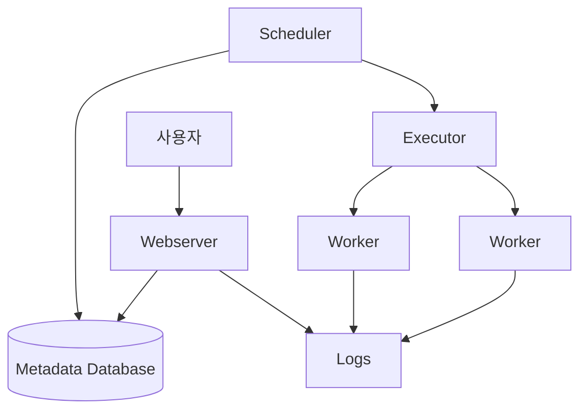

# Step 1: Airflow 핵심 개념 및 아키텍처

## 1. Apache Airflow란?
Apache Airflow는 복잡한 데이터 파이프라인을 **작성(Author), 스케줄링(Schedule), 모니터링(Monitor)**하기 위한 오픈소스 플랫폼입니다.
Python 코드로 워크플로우를 정의하므로("Configuration as Code"), 파이프라인을 버전 관리하고 협업하며 테스트하기 용이합니다.

### 🚀 왜 Cron 대신 Airflow를 쓰나요?
| 기능 | Cron | Airflow |
| :--- | :--- | :--- |
| **의존성 관리** | 어려움 (시간 기반 추측) | **강력함** (Task A 성공 시 Task B 실행) |
| **재시도(Retry)** | 스크립트 내 구현 필요 | **내장 기능** (설정만으로 가능) |
| **모니터링** | 로그 파일 확인 필요 | **웹 UI** 제공 (실패 지점 시각화) |
| **확장성** | 단일 서버 의존 | **분산 처리** 가능 (Celery, K8s) |

---

## 2. Airflow 아키텍처 (Architecture)

Airflow는 4가지 주요 컴포넌트로 구성됩니다.

1.  **Webserver (웹서버)**: DAG 상태를 확인하고 수동으로 실행하거나 로그를 볼 수 있는 Flask 기반 UI입니다.
2.  **Scheduler (스케줄러)**:
    - DAG 파일을 파싱하고 실행 시점을 체크합니다.
    - 실행 조건이 충족된 Task를 **Executor**에게 전달합니다. (Airflow의 "심장")
3.  **Metadata Database (메타데이터 DB)**:
    - DAG, Task, Run, Variable, Connection 등의 모든 상태 정보를 저장합니다. (보통 PostgreSQL 사용)
4.  **Executor (실행기)**:
    - 스케줄러가 지정한 작업을 **어떻게, 어디서** 실행할지 결정합니다.
    - **LocalExecutor**: 스케줄러와 같은 프로세스에서 실행 (단일 머신, 학습용).
    - **CeleryExecutor / KubernetesExecutor**: 여러 워커 노드에 작업을 분산 (운영용).
5.  **Worker (워커)**: 실제 작업을 수행하는 프로세스입니다.

---

## 3. 핵심 용어 (Core Concepts)

### 3.1 DAG (Directed Acyclic Graph)
- **비순환 유향 그래프**: 작업의 흐름을 정의한 것.
- "비순환"이란 A -> B -> A 처럼 무한 루프가 없다는 뜻입니다.
- Python 파일 하나가 보통 하나의 DAG를 정의합니다.

### 3.2 Operator (오퍼레이터)
- DAG를 구성하는 **작업의 템플릿(설계도)**입니다.
- 무엇을 할지를 정의합니다.
    - `BashOperator`: 쉘 스크립트 실행
    - `PythonOperator`: 파이썬 함수 실행
    - `PostgresOperator`: DB 쿼리 실행
    - `SimpleHttpOperator`: API 호출

### 3.3 Task (태스크)
- Operator가 DAG 안에서 실체화된(instantiated) 것입니다.
- 예: "이메일 전송 Operator"를 사용하여 "팀장에게 전송 Task"와 "팀원에게 전송 Task"를 만듦.

### 3.4 Task Instance (태스크 인스턴스)
- 특정 시간에 실행된 Task입니다. (Task + 시점)
- 상태를 가집니다: `running`, `success`, `failed`, `skipped`, `up_for_retry`

### 3.5 Execution Date (실행 기준일) ⚠️ 중요
- **Airflow의 가장 헷갈리는 개념**입니다.
- `Execution Date`는 **"실행이 시작된 실제 시간"이 아니라, "이 작업이 처리해야 할 데이터의 기간(Period)의 시작점"**입니다.
- 예: 매일 0시(자정)에 도는 데일리 배치
    - 1월 2일 00:00에 실행되는 작업의 `execution_date`는 **1월 1일**입니다.
    - 이유: 1월 1일 하루 종일 쌓인 데이터를 1월 2일에 처리하기 때문입니다.

---

## 4. 요약
- Airflow는 **Python 코드로 정의하는 워크플로우** 시스템이다.
- **Scheduler**가 지휘하고, **Executor**가 배정하며, **Worker**가 일한다.
- **DAG**는 작업의 흐름이고, **Operator**는 작업의 종류이다.
- **Execution Date**는 실제 실행 시간이 아니라 **데이터 기준 시간**이다.
