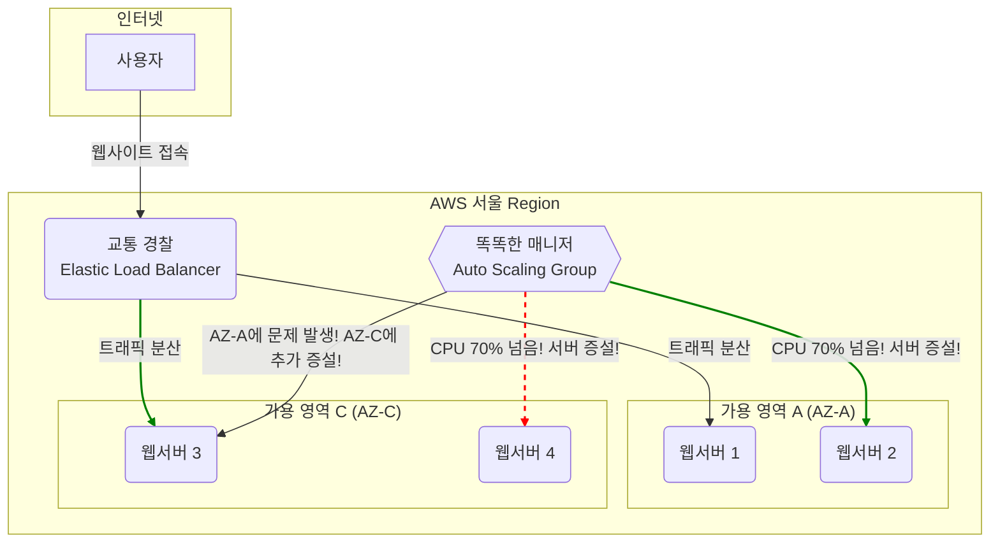

# Step 1: 핵심 컴퓨팅 및 인프라

## 학습 목표

AWS 글로벌 인프라(Region/AZ)의 물리적 제약과 기회를 이해하고, 이를 바탕으로 EC2와 Auto Scaling을 사용하여 장애에 강하고(fault-tolerant) 수요에 따라 자동으로 확장/축소(elastic)되는 컴퓨팅 환경을 구축하는 원리를 학습합니다.

---

## 1. 핵심 개념 (Professional's View)

-   **Region & Availability Zone (AZ)**:
    -   **Region**: 완전한 자원을 갖춘 독립적인 지리적 위치(예: `ap-northeast-2` for Seoul). 지연 시간(latency), 데이터 주권(data sovereignty) 및 규정 준수 요구사항에 따라 선택합니다.
    -   **AZ**: Region 내에 위치하며, 독립된 전원, 냉각, 네트워크를 갖춘 하나 이상의 데이터 센터. AZ들은 초고속 사설 네트워크로 연결되어 있어 동기식 복제가 가능할 정도로 지연 시간이 매우 짧습니다. Multi-AZ 배포는 고가용성(High Availability) 아키텍처의 기본입니다.

-   **EC2 (Elastic Compute Cloud)**:
    -   AWS에서 제공하는 안전하고 크기 조정이 가능한 컴퓨팅 파워를 제공하는 가상 서버. 다양한 인스턴스 유형(범용, 컴퓨팅 최적화, 메모리 최적화 등)을 제공하여 워크로드에 맞는 최적의 리소스를 선택할 수 있습니다.

-   **AMI (Amazon Machine Image)**:
    -   EC2 인스턴스를 시작하는 데 필요한 정보를 담은 템플릿. OS, 애플리케이션 서버, 애플리케이션 코드가 포함될 수 있습니다. AMI는 불변 인프라(Immutable Infrastructure) 패턴을 구현하는 핵심 요소로, 배포의 일관성과 재현성을 보장합니다.

-   **Elastic Load Balancer (ELB) & Auto Scaling Group (ASG)**:
    -   **ELB**: 들어오는 트래픽을 여러 대상(예: EC2 인스턴스)에 자동으로 분산시킵니다. 단일 장애점(Single Point of Failure)을 방지하고 애플리케이션의 가용성과 내결함성을 높입니다.
    -   **ASG**: 정의된 조건(예: CPU 사용률 70% 이상)에 따라 EC2 인스턴스 수를 자동으로 조정합니다. 수요 급증에 대응하여 확장(Scale-out)하고 유휴 시간에 축소(Scale-in)하여 비용 효율성을 달성합니다.

---

## 2. 쉬운 비유 (Beginner's View)

-   **EC2**는 **인터넷에 있는 내 전용 컴퓨터 한 대**입니다.
-   **Region**은 **'서울', '도쿄' 같은 도시**이고, **AZ**는 그 도시 안에 있는 **물리적으로 떨어진 '강남 전산실', '구로 전산실'** 입니다. 강남이 정전돼도 구로는 안전한 것처럼, 서비스를 여러 AZ에 나눠두면 한 곳에 문제가 생겨도 서비스가 멈추지 않습니다.
-   **ELB**는 **교통 경찰**입니다. 손님(트래픽)이 몰리면 여러 대의 컴퓨터(EC2)로 골고루 안내하여 한 컴퓨터만 과부하에 걸리지 않게 합니다.
-   **ASG**는 **똑똑한 매니저**입니다. 손님이 많아지면 컴퓨터를 자동으로 더 늘리고, 손님이 줄면 컴퓨터를 줄여서 불필요한 요금이 나가지 않게 합니다.
-   **AMI**는 **'모든 설정이 완료된 컴퓨터 복제용 원본 CD'** 입니다. 이 CD만 있으면 언제든 똑같은 컴퓨터를 수백 대라도 즉시 만들어낼 수 있습니다.

---

## 3. 시각화 (Architecture)



---

## 4. 나쁜 예시 (Bad Practice)

### 단일 인스턴스, 단일 AZ 배포
-   **코드**: `aws ec2 run-instances --image-id ami-12345678 --instance-type t2.micro --placement AvailabilityZone=ap-northeast-2a`
-   **문제점**:
    -   **SPOF (Single Point of Failure)**: 해당 EC2 인스턴스에 장애가 발생하거나 `ap-northeast-2a` AZ 자체에 문제가 생기면 서비스가 즉시 중단됩니다.
    -   **확장성 부재**: 트래픽이 증가해도 수동으로 더 큰 사양의 인스턴스로 교체(Scale-up)해야 하며, 이 과정에서 다운타임이 발생합니다. 자동화된 수평 확장(Scale-out)이 불가능합니다.

---

## 5. 좋은 예시 (Good Practice)

### Multi-AZ와 Auto Scaling을 결합한 탄력적 아키텍처
-   **코드**:
    ```bash
    # 1. 모든 설정이 완료된 인스턴스로 AMI 생성
    aws ec2 create-image --instance-id i-master --name "WebApp_V2_AMI"

    # 2. 생성된 AMI로 Launch Template 정의
    aws ec2 create-launch-template --launch-template-name WebApp_LT --launch-template-data '{"ImageId":"ami-webapp-v2"}'

    # 3. 2개의 AZ에 걸쳐 Auto Scaling Group 생성
    aws autoscaling create-auto-scaling-group --auto-scaling-group-name WebApp_ASG \
      --launch-template "LaunchTemplateName=WebApp_LT" \
      --min-size 2 --max-size 10 \
      --availability-zones "ap-northeast-2a" "ap-northeast-2c" \
      --target-group-arns <elb_target_group_arn>
    ```
-   **개선점**:
    -   **고가용성 (High Availability)**: 인스턴스들이 최소 2개의 AZ에 분산되어 있어 하나의 AZ가 다운되어도 서비스 연속성이 보장됩니다.
    -   **탄력성 (Elasticity)**: ASG가 CPU 사용률 같은 지표를 모니터링하여 자동으로 인스턴스 수를 조절하므로, 비용 효율성과 안정성을 동시에 확보할 수 있습니다.
    -   **일관성 및 신속성 (Consistency & Agility)**: 모든 인스턴스는 검증된 AMI를 통해 배포되므로 구성이 일관되며, 필요 시 수 분 내에 수십, 수백 개의 서버를 자동으로 증설할 수 있습니다.

---

## 6. 핵심 학습 포인트

-   **고가용성은 분산에서 나온다**: 단일 장애점(SPOF)을 제거하는 것이 클라우드 아키텍처의 첫걸음입니다. 항상 Multi-AZ 배포를 기본으로 고려해야 합니다.
-   **Scale-up vs Scale-out**: 서버 사양을 높이는 것(Scale-up)은 한계가 있고 비용이 비쌉니다. 비슷한 사양의 서버 개수를 늘리는 것(Scale-out)이 클라우드 환경의 확장 패러다임이며, 이를 위해 ELB와 ASG는 필수적입니다.
-   **인프라를 애완동물이 아닌 가축처럼 다루어라 (Pets vs Cattle)**: 수동으로 하나하나 관리하는 서버(Pet)가 아니라, 언제든지 동일한 구성으로 대체 가능한 서버(Cattle)들로 시스템을 구성해야 합니다. AMI는 이러한 '가축'을 찍어내는 틀의 역할을 합니다.
