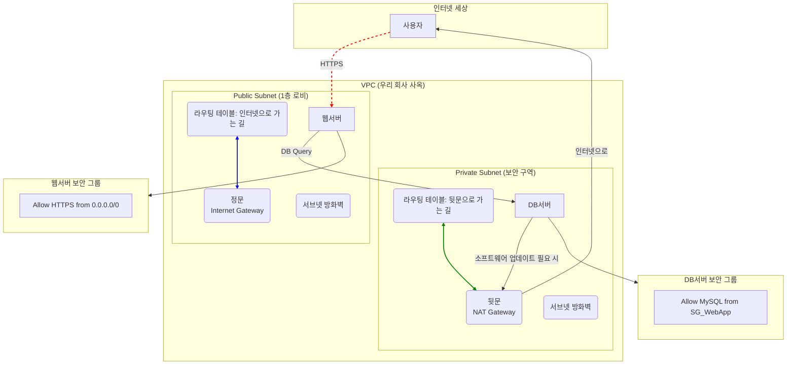

# Step 3: VPC 기반의 네트워크 격리

## 학습 목표

클라우드 환경에서 네트워크 보안의 기초가 되는 VPC(Virtual Private Cloud)를 설계하는 방법을 학습합니다. Public/Private 서브넷으로 리소스를 논리적으로 격리하고, 라우팅 테이블과 보안 그룹을 통해 트래픽을 제어하여 안전한 다중 계층(Multi-tier) 아키텍처를 구축합니다.

---

## 1. 핵심 개념 (Professional's View)

-   **VPC (Virtual Private Cloud)**: AWS 클라우드 내에서 사용자의 계정 전용으로 논리적으로 격리된 가상 네트워크 공간. CIDR 블록 표기법(예: `10.0.0.0/16`)으로 사설 IP 주소 범위를 직접 정의할 수 있어, 온프레미스 네트워크와의 IP 충돌을 피하고 체계적인 IP 관리가 가능합니다.

-   **Subnet**: VPC의 IP 주소 범위를 더 작은 단위로 나눈 네트워크. 특정 가용 영역(AZ) 내에 존재하며, 리소스의 물리적 위치와 네트워크 접근성을 결정합니다.
    -   **Public Subnet**: 라우팅 테이블이 인터넷 게이트웨이(IGW)로 향하는 경로를 가진 서브넷. 서브넷 내 리소스는 인터넷에서 직접 접근(Inbound) 및 외부로의 접근(Outbound)이 모두 가능합니다.
    -   **Private Subnet**: 인터넷 게이트웨이로의 경로가 없는 서브넷. 외부에서 직접 접근이 불가능하여 DB 서버 등 내부 리소스를 보호하는 데 사용됩니다. 외부 통신이 필요할 경우 NAT Gateway를 통해 Outbound 트래픽만 허용할 수 있습니다.

-   **Routing & Gateways**:
    -   **Route Table**: 서브넷에서 발생하는 네트워크 트래픽이 어디로 가야 할지를 결정하는 라우팅 규칙의 집합.
    -   **Internet Gateway (IGW)**: VPC와 인터넷 간의 통신을 가능하게 하는 게이트웨이.
    -   **NAT Gateway**: Private Subnet의 인스턴스가 외부 인터넷(예: 소프트웨어 업데이트)에 접속할 수 있도록 해주는 아웃바운드 전용 게이트웨이.

-   **Security Layers**:
    -   **Security Group (SG)**: 인스턴스 수준에서 동작하는 상태 저장(Stateful) 방화벽. 인바운드 트래픽이 허용되면 해당 트래픽의 응답(아웃바운드)은 자동으로 허용됩니다. `Allow` 규칙만 설정 가능.
    -   **Network ACL (NACL)**: 서브넷 수준에서 동작하는 상태 비저장(Stateless) 방화벽. 인바운드와 아웃바운드 규칙을 각각 명시적으로 설정해야 합니다. `Allow`와 `Deny` 규칙 모두 사용 가능하며, 규칙 번호가 낮은 순서대로 적용됩니다.

---

## 2. 쉬운 비유 (Beginner's View)

-   **VPC**는 **우리 회사만의 독립된 사옥 건물**입니다. AWS라는 거대한 도시에 건물을 짓고 우리 회사만의 주소 체계(IP 대역)를 가집니다.
-   **Subnet**은 사옥 내의 **'층' 또는 '구역'** 입니다.
    -   **Public Subnet**은 1층 로비나 외부 쇼룸처럼 **인터넷에 공개된 구역**입니다. 누구나 방문할 수 있는 웹서버(안내데스크)를 여기에 둡니다.
    -   **Private Subnet**은 내부 직원만 카드키로 들어갈 수 있는 **보안 구역**입니다. 고객 개인정보가 담긴 DB서버(금고)나 핵심 개발 서버를 여기에 둡니다.
-   **Internet Gateway**는 사옥의 **'정문'** 입니다. 이 문이 있어야 인터넷 세상과 소통할 수 있습니다.
-   **NAT Gateway**는 내부 직원이 밖에 나갈 때만 사용하는 **'보안 게이트가 있는 뒷문'** 입니다. 안에서 밖으로 나가는 것은 되지만(소프트웨어 업데이트), 밖에서 안으로 들어올 수는 없어 안전합니다.
-   **Security Group**은 각 서버에 붙어있는 **'개별 방화벽' 또는 '출입 허가증'** 입니다. "이 DB서버는 오직 웹서버의 요청만 받는다"는 식으로 아주 세부적인 규칙을 정할 수 있습니다.

---

## 3. 시각화 (Architecture)

---

## 4. 나쁜 예시 (Bad Practice)

### 모든 리소스를 Public Subnet에 배포
-   **상황**: VPC를 만들었지만, 편의상 모든 인스턴스(웹서버, DB서버 등)를 Public Subnet 안에 배치했습니다.
-   **문제점**:
    -   **직접적인 공격 노출**: DB서버가 인터넷에서 직접 접근 가능한 공인 IP를 가질 수 있게 됩니다. 이는 해커에게 직접적인 공격 포인트를 제공하는 것과 같으며, 데이터베이스의 모든 정보가 탈취될 위험에 처합니다.
    -   **네트워크 제어 불가**: 모든 리소스가 동일한 네트워크 환경에 있어, 리소스 간의 트래픽을 세밀하게 제어하기 어렵고 내부 확산(Lateral Movement) 공격에 취약해집니다.

---

## 5. 좋은 예시 (Good Practice)

### 다중 계층(Multi-tier) 아키텍처를 위한 네트워크 격리
-   **프로세스**:
    1.  **VPC 생성**: 회사 정책에 맞는 사설 IP 대역으로 VPC를 생성합니다.
    2.  **서브넷 분리**: 외부 사용자의 요청을 직접 받는 **Web Tier**를 위한 Public Subnet과, 내부 로직을 처리하고 데이터를 저장하는 **Application/Database Tier**를 위한 Private Subnet을 생성합니다.
    3.  **라우팅 설정**: Public Subnet의 라우팅 테이블은 IGW를, Private Subnet의 라우팅 테이블은 NAT Gateway를 목적지로 설정합니다.
    4.  **보안 그룹 설정**: Web Tier의 SG는 인터넷으로부터의 HTTP/HTTPS 트래픽만 허용하고, DB Tier의 SG는 오직 Web Tier의 SG로부터 오는 DB 포트 트래픽만 허용하도록 설정합니다. (`source-group` 옵션 사용)
-   **개선점**:
    -   **Defense in Depth (심층 방어)**: 인터넷 -> Public Subnet -> Private Subnet으로 이어지는 다중 방어 계층을 구축하여 보안을 크게 강화합니다. 해커가 웹서버를 뚫더라도 DB서버는 다른 네트워크에 격리되어 있어 직접적인 접근이 불가능합니다.
    -   **공격 표면 최소화 (Minimize Attack Surface)**: 외부에 노출되는 리소스를 최소화하고, 리소스 간 통신은 필요한 최소한의 포트와 프로토콜만 허용하여 공격자가 악용할 수 있는 경로를 줄입니다.

---

## 6. 핵심 학습 포인트

-   **VPC는 클라우드 보안의 기초**: 인프라를 설계할 때 가장 먼저 고려해야 할 요소는 논리적 네트워크 격리입니다. 기본 VPC(Default VPC)는 테스트 용도로만 사용하고, 프로덕션 환경에서는 반드시 커스텀 VPC를 설계해야 합니다.
-   **Public은 공개, Private은 보호**: 리소스의 역할에 따라 위치를 명확히 구분해야 합니다. 외부에 공개될 필요가 없는 모든 리소스는 Private Subnet에 두는 것이 원칙입니다.
-   **Security Group은 허용 목록(Allow-list) 기반**: SG는 기본적으로 모든 것을 차단하고, 필요한 것만 명시적으로 허용하는 방식입니다. '무엇을 막을까'가 아니라 '무엇을 허용할까'의 관점에서 규칙을 설정해야 합니다.
-   **상태 저장(Stateful) vs 상태 비저장(Stateless)**: SG(Stateful)는 한번 허용한 요청의 응답은 자동으로 허용해주어 편리하고, NACL(Stateless)은 들어오고 나가는 것을 각각 규칙으로 정의해야 해서 더 엄격한 제어가 가능합니다. 대부분의 경우 SG만으로도 충분한 보안 구성이 가능합니다.
