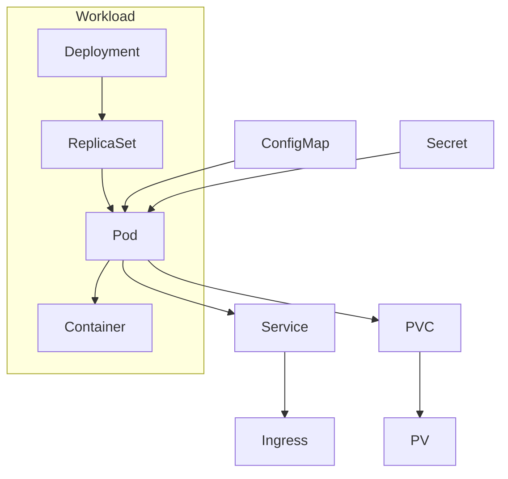
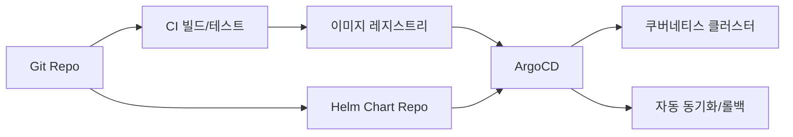

# Kubernetes 학습 계획

## 개요 (Overview)
Kubernetes는 컨테이너화된 워크로드를 자동으로 배포, 스케일링 및 관리하는 오픈소스 플랫폼입니다. 클라우드 환경에서 애플리케이션의 가용성, 확장성, 효율성을 높이는 데 필수적인 도구로 자리 잡았습니다. 이 학습 계획은 Kubernetes의 기본 개념부터 클러스터 운영, 애플리케이션 배포 및 관리, 그리고 고급 기능까지 실무에 필요한 지식을 습득하는 것을 목표로 합니다.

## 학습 목표 (Learning Objectives)
*   Kubernetes 아키텍처 및 핵심 구성 요소 이해
*   kubectl 명령어를 이용한 클러스터 관리
*   Pod, Deployment, Service 등 주요 리소스 객체 활용
*   애플리케이션 배포, 스케일링, 업데이트 및 롤백
*   Kubernetes 환경에서 로깅, 모니터링, 네트워킹 설정

## 학습 내용 (Learning Content)





### Helm values 예시 (간단)
```yaml
image:
  repository: myapp
  tag: "1.0.0"
  pullPolicy: IfNotPresent
resources:
  requests:
    cpu: 100m
    memory: 128Mi
  limits:
    cpu: 200m
    memory: 256Mi
ingress:
  enabled: true
  hosts:
    - host: myapp.example.com
      paths: [/]
```

### ArgoCD Application 예시
```yaml
apiVersion: argoproj.io/v1alpha1
kind: Application
metadata:
  name: myapp
  namespace: argocd
spec:
  destination:
    namespace: default
    server: https://kubernetes.default.svc
  source:
    repoURL: https://github.com/org/myapp-helm.git
    path: charts/myapp
    targetRevision: main
  syncPolicy:
    automated:
      prune: true
      selfHeal: true
```

| 명령/파일 | 기대 효과 | 흔한 실수 |
| --- | --- | --- |
| `kubectl apply -f deployment.yaml` | 선언적 배포/업데이트 | `kubectl run`으로 임시 리소스 남김 |
| `kubectl rollout status deploy/myapp` | 배포 완료 여부 확인 | 상태 확인 없이 바로 트래픽 전환 |
| `helm upgrade --install myapp ./chart -f values.yaml` | 차트 배포 | values 오타로 이미지/리소스 잘못 배포 |
| ArgoCD Application | Git 기반 선언적 배포/자동 동기화 | 소스 경로(path)·revision 오타, 자동 삭제(prune) 미설정 |

### 오토스케일/HPA 예시
```yaml
apiVersion: autoscaling/v2
kind: HorizontalPodAutoscaler
metadata:
  name: myapp-hpa
spec:
  scaleTargetRef:
    apiVersion: apps/v1
    kind: Deployment
    name: myapp
  minReplicas: 2
  maxReplicas: 10
  metrics:
    - type: Resource
      resource:
        name: cpu
        target:
          type: Utilization
          averageUtilization: 70
```

### PDB/Anti-Affinity 짧은 샘플
```yaml
apiVersion: policy/v1
kind: PodDisruptionBudget
metadata:
  name: myapp-pdb
spec:
  minAvailable: 2
  selector:
    matchLabels:
      app: myapp
---
apiVersion: apps/v1
kind: Deployment
spec:
  template:
    spec:
      affinity:
        podAntiAffinity:
          requiredDuringSchedulingIgnoredDuringExecution:
          - labelSelector:
              matchExpressions:
              - key: app
                operator: In
                values: [myapp]
            topologyKey: "kubernetes.io/hostname"
```

### 1단계: 컨테이너 및 Kubernetes 기본 (Containers & Kubernetes Basics)
*   컨테이너 개념 및 Docker (Container Concepts & Docker) - 가상화와의 비교
*   Kubernetes 소개 (Introduction to Kubernetes) - 탄생 배경, 목적, 특징
*   Kubernetes 아키텍처 (Kubernetes Architecture) - Master/Control Plane, Worker Node
*   kubectl 도구 설치 및 설정 (Installing & Configuring kubectl)
*   Minikube 또는 Kind를 이용한 로컬 클러스터 생성 (Creating Local Cluster with Minikube/Kind)

### 2단계: Kubernetes 리소스 객체 (Kubernetes Resource Objects)
*   Pod (파드) - Kubernetes의 가장 작은 배포 단위
    *   Pod의 생명 주기, 다중 컨테이너 Pod (Sidecar 패턴)
*   ReplicaSet (레플리카셋) - Pod의 복제본 관리
*   Deployment (디플로이먼트) - 선언적인 Pod 및 ReplicaSet 관리
    *   애플리케이션 배포, 업데이트, 롤백
*   Service (서비스) - Pod에 대한 안정적인 네트워크 접근 제공
    *   ClusterIP, NodePort, LoadBalancer, ExternalName 타입
*   Namespace (네임스페이스) - 리소스 격리

### 3단계: 스토리지 및 구성 관리 (Storage & Configuration Management)
*   볼륨 (Volumes) - Pod에 데이터 저장
    *   EmptyDir, HostPath, PersistentVolume (PV), PersistentVolumeClaim (PVC)
*   ConfigMap (컨피그맵) - 환경 변수 및 설정 파일 관리
*   Secret (시크릿) - 민감한 정보(비밀번호, API 키) 관리
*   Job (잡) 및 CronJob (크론잡) - 일회성/주기적 작업 실행

### 4단계: 네트워킹 및 인그레스 (Networking & Ingress)
*   Kubernetes 네트워킹 모델 (Kubernetes Networking Model)
*   Pod 간 통신 (Pod-to-Pod Communication)
*   Service Discovery (서비스 디스커버리) - DNS
*   Ingress (인그레스) - 외부 트래픽을 클러스터 내부 서비스로 라우팅
    *   Ingress Controller (Nginx Ingress Controller 등)

### 5단계: 고급 기능 및 운영 (Advanced Features & Operations)
*   Helm (헬름) - Kubernetes 애플리케이션 패키지 관리
*   Health Checks (헬스 체크) - Liveness Probe, Readiness Probe, Startup Probe
*   Resource Limits and Requests (리소스 제한 및 요청) - QoS 클래스
*   스케줄링 (Scheduling) - Node Affinity, Taints & Tolerations
*   로깅 및 모니터링 (Logging & Monitoring) - Prometheus, Grafana, ELK Stack
*   보안 (Security) - RBAC, Network Policy, Pod Security Standards
*   Kubernetes 클러스터 배포 (Deploying Kubernetes Clusters) - kubeadm, AKS, GKE, EKS

## 예상 학습 시간 (Estimated Learning Time)
*   각 단계별 5-10시간 (총 25-50시간)

## 실습 과제 (Practical Exercises)
*   간단한 웹 애플리케이션을 Docker 이미지로 빌드하고 Kubernetes에 배포 (Build & deploy a web app to Kubernetes)
*   Deployment 및 Service를 사용하여 애플리케이션 스케일링 및 업데이트 (Scale & update applications using Deployment & Service)
*   ConfigMap과 Secret을 이용하여 애플리케이션 설정 관리 (Manage app config with ConfigMap & Secret)
*   Helm 차트를 이용하여 복잡한 애플리케이션 배포 (Deploy complex applications using Helm charts)
*   Ingress Controller를 설치하고 외부에서 애플리케이션 접근 설정 (Set up Ingress Controller for external access)

## 참고 자료 (References)
*   Kubernetes 공식 문서 (Kubernetes Official Documentation)
*   Kubernetes in Action by Marko Lukša
*   Kubernetes Up and Running by Brendan Burns, Joe Beda, Kelsey Hightower
*   Certified Kubernetes Administrator (CKA) / Certified Kubernetes Application Developer (CKAD) 강의
