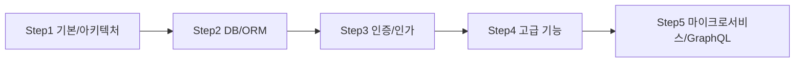
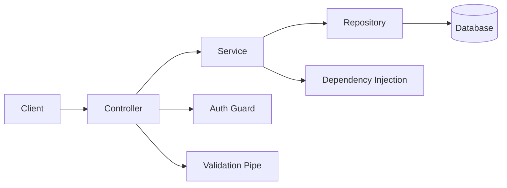

# NestJS 학습 계획

## 개요 (Overview)
NestJS는 Node.js 기반의 서버 사이드 애플리케이션 개발을 위한 프로그레시브(progressive) Node.js 프레임워크입니다. TypeScript를 기본으로 지원하며, Angular에서 영감을 받은 모듈, 컨트롤러, 프로바이더와 같은 구조를 통해 확장 가능하고 유지보수하기 쉬운 애플리케이션을 구축하도록 돕습니다. 이 학습 계획은 NestJS의 기본 개념부터 고급 기능, 그리고 실제 프로젝트에 적용하는 방법까지 다루어, 엔터프라이즈급 백엔드 서비스를 개발하는 역량을 키우는 것을 목표로 합니다.

## 학습 목표 (Learning Objectives)
*   NestJS의 아키텍처 및 핵심 원리 이해
*   모듈, 컨트롤러, 프로바이더 등 주요 빌딩 블록 활용
*   데이터베이스 통합 및 인증/인가 구현
*   테스트 코드 작성 및 예외 처리 전략 수립
*   마이크로서비스 및 GraphQL과 같은 고급 기능 적용

## 학습 내용 (Learning Content)





---

### 성능/안정성 체크리스트
- Validation Pipe 전역 적용: DTO + `class-validator`로 요청 입력 검증.
- 캐싱: `CacheModule` + `@UseInterceptors(CacheInterceptor)`로 읽기 트래픽 감소.
- DB 커넥션 풀: ORM 커넥션 수, 타임아웃 적절히 설정.
- 로깅/트레이싱: `Logger`, `nestjs-pino`, OpenTelemetry 연동.
- 헬스체크: `@nestjs/terminus`로 `/healthz` 엔드포인트 제공.

```ts
// main.ts - 전역 파이프/캐시 예시
async function bootstrap() {
  const app = await NestFactory.create(AppModule);
  app.useGlobalPipes(new ValidationPipe({ whitelist: true, transform: true }));
  app.useGlobalInterceptors(new CacheInterceptor(app.get(CacheManager)));
  await app.listen(3000);
}
```

### 1단계: NestJS 기본 개념 및 시작 (NestJS Basics & Getting Started)
*   NestJS 소개 (Introduction to NestJS) - 철학, 장점
*   Node.js 프레임워크 생태계에서의 위치 (Position in Node.js Ecosystem)
*   프로젝트 생성 (Project Creation) - Nest CLI
*   기본 구조 이해 (Understanding Basic Structure) - AppModule, Main.ts
*   컨트롤러(Controllers) - 라우팅 및 요청 처리
*   프로바이더(Providers) - 서비스, 레포지토리
*   모듈(Modules) - 애플리케이션 구성 단위

### 2단계: 데이터베이스 통합 및 ORM (Database Integration & ORM)
*   관계형 데이터베이스 연동 (Relational Database Integration) - TypeORM, Prisma
*   비관계형 데이터베이스 연동 (Non-Relational Database Integration) - Mongoose (MongoDB)
*   스키마 정의 및 모델링 (Schema Definition & Modeling)
*   CRUD 작업 구현 (Implementing CRUD Operations)
*   트랜잭션 관리 (Transaction Management)

### E2E 테스트 스니펫
```ts
// test/app.e2e-spec.ts
import { Test, TestingModule } from '@nestjs/testing';
import { INestApplication } from '@nestjs/common';
import * as request from 'supertest';
import { AppModule } from '../src/app.module';

describe('App (e2e)', () => {
  let app: INestApplication;

  beforeAll(async () => {
    const moduleFixture: TestingModule = await Test.createTestingModule({
      imports: [AppModule],
    }).compile();
    app = moduleFixture.createNestApplication();
    await app.init();
  });

  it('/health (GET)', () => {
    return request(app.getHttpServer()).get('/health').expect(200);
  });
});
```

### 3단계: 인증 및 인가 (Authentication & Authorization)
*   인증(Authentication) 전략 (Authentication Strategies) - Local, JWT, OAuth
*   JWT(JSON Web Token) 구현 (Implementing JWT)
*   가드(Guards)를 이용한 인가(Authorization) (Authorization with Guards) - RBAC
*   패스포트(Passport) 통합 (Passport.js Integration)
*   미들웨어(Middleware) 및 인터셉터(Interceptors) 활용

### 4단계: 고급 기능 및 모범 사례 (Advanced Features & Best Practices)
*   파이프(Pipes) - 데이터 변환 및 유효성 검사
*   필터(Filters) - 예외 처리
*   커스텀 데코레이터 (Custom Decorators)
*   유효성 검사 (Validation) - Class-validator
*   환경 설정 (Configuration) - ConfigModule
*   로깅 (Logging) - Winston, Pino
*   테스트 (Testing) - 유닛, 통합, E2E 테스트

### 5단계: 마이크로서비스 및 GraphQL (Microservices & GraphQL)
*   마이크로서비스 아키텍처 (Microservices Architecture) - NestJS Microservices
    *   TCP, Redis, Kafka, RabbitMQ 등의 트랜스포터
*   GraphQL 통합 (GraphQL Integration)
    *   Code-first vs Schema-first
    *   Resolver, Schema 정의
*   웹소켓(WebSockets) 구현 (Implementing WebSockets) - Gateway
*   CLI 활용 및 코드 제너레이션 (CLI Usage & Code Generation)

## 예상 학습 시간 (Estimated Learning Time)
*   각 단계별 4-7시간 (총 20-35시간)

## 실습 과제 (Practical Exercises)
*   간단한 REST API 서버 구축 (Build a simple REST API server) - CRUD 기능 포함
*   JWT 기반 인증 시스템 구현 (Implement a JWT-based authentication system)
*   데이터베이스 연동 및 ORM을 사용한 데이터 관리 (Integrate database and manage data with ORM)
*   GraphQL API 서버 구축 (Build a GraphQL API server)
*   테스트 코드 작성 및 예외 처리 적용 (Write tests and apply exception handling)

## 참고 자료 (References)
*   NestJS 공식 문서 (NestJS Official Documentation)
*   NestJS: A Complete Guide by Kamil Mysliwiec
*   TypeScript 및 Node.js 관련 자료 (TypeScript and Node.js resources)
