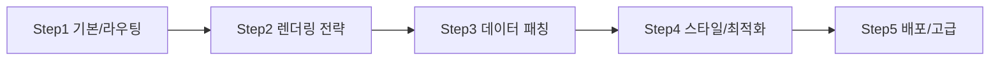
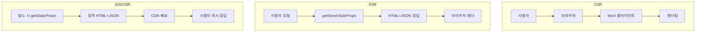

# Next.js 학습 계획

## 개요 (Overview)
Next.js는 React 기반의 프레임워크로, 서버 사이드 렌더링(SSR), 정적 사이트 생성(SSG) 및 하이브리드 웹 애플리케이션 개발을 위한 강력한 기능을 제공합니다. 이 학습 계획은 Next.js의 기본 개념부터 고급 기능, 그리고 실제 프로젝트에 적용하는 방법까지 다루어, 성능과 SEO에 최적화된 웹 애플리케이션을 개발하는 역량을 키우는 것을 목표로 합니다.

## 학습 목표 (Learning Objectives)
*   Next.js의 핵심 기능 및 장점 이해
*   SSR, SSG, CSR 등 다양한 렌더링 방식 숙달
*   파일 시스템 기반 라우팅 및 API 라우팅 활용
*   데이터 페칭 전략(getServerSideProps, getStaticProps 등) 이해 및 적용
*   성능 최적화 및 배포 전략 수립

## 학습 내용 (Learning Content)





---

### 데이터 패칭 코드 스니펫 (SSR vs SSG/ISR)
```tsx
// pages/products/[id].tsx - SSR
export async function getServerSideProps({ params }) {
  const res = await fetch(`https://api.example.com/products/${params.id}`);
  const product = await res.json();
  return { props: { product } };
}
export default function Product({ product }) { /* ... */ }
```

```tsx
// pages/blog/[slug].tsx - SSG + ISR
export async function getStaticPaths() {
  const slugs = await fetch("https://api.example.com/blog/slugs").then(r=>r.json());
  return { paths: slugs.map((s)=>({ params:{ slug:s }})), fallback: 'blocking' };
}
export async function getStaticProps({ params }) {
  const post = await fetch(`https://api.example.com/blog/${params.slug}`).then(r=>r.json());
  return { props: { post }, revalidate: 60 }; // ISR: 60초마다 재생성
}
```

### 성능 체크리스트
- 렌더링 전략: 데이터 변동 빈도에 따라 CSR/SSR/SSG/ISR 선택.
- 캐싱: `Cache-Control`, ISR `revalidate`, Edge CDN 적극 활용.
- 이미지 최적화: `next/image` + 자동 크기조절/포맷 전환.
- 번들 최적화: `next/dynamic`로 코드 스플리팅, 불필요한 polyfill 제거.
- 측정: `next build`의 분석 리포트, Lighthouse/Next Analytics 확인.

### 코드 스플리팅/지연 로딩 예시
```tsx
import dynamic from "next/dynamic";
const Chart = dynamic(() => import("../components/Chart"), { ssr: false, loading: () => <p>Loading...</p> });

export default function Dashboard({ data }) {
  return (
    <main>
      <h1>Dashboard</h1>
      <Chart data={data} /> {/* 차트는 클라이언트 전용, 초기 번들 분리 */}
    </main>
  );
}
```

### Edge/서버 캐싱 힌트 (App Router 예시)
```tsx
export const revalidate = 120;          // ISR 주기
export const dynamic = "force-static";  // 강제 정적
export const fetchCache = "force-cache";

export default async function Page() {
  const data = await fetch("https://api.example.com/data", { next: { revalidate: 120 }}).then(r=>r.json());
  return <pre>{JSON.stringify(data,null,2)}</pre>;
}
```

### 측정 & 분석 퀵 가이드
- `next build` → 번들 분석: `ANALYZE=true next build` 환경변수 사용.
- Lighthouse: Performance/SEO/Best Practices 점수 체크, LCP/CLS 개선 목표 설정.
- Web Vitals 로깅: `_app.tsx`에서 `reportWebVitals` 구현 후 APM/Log 전송.

### Web Vitals 로깅 코드 (pages/_app.tsx)
```tsx
export function reportWebVitals(metric) {
  const body = JSON.stringify(metric);
  navigator.sendBeacon?.('/vitals', body) ||
    fetch('/vitals', { method: 'POST', body, keepalive: true, headers: { 'Content-Type': 'application/json' } });
}
```

### Edge 캐싱 힌트 (Middleware 예시)
```ts
// middleware.ts
import { NextResponse } from 'next/server';
export function middleware(req) {
  const res = NextResponse.next();
  res.headers.set('Cache-Control', 'public, max-age=60, s-maxage=300, stale-while-revalidate=600');
  return res;
}
export const config = { matcher: ['/products/:path*'] };
```

### 1단계: Next.js 기본 개념 및 시작 (Next.js Basics & Getting Started)
*   Next.js 소개 (Introduction to Next.js) - React와의 차이점
*   Next.js 프로젝트 생성 (Creating Next.js Project) - `create-next-app`
*   파일 시스템 기반 라우팅 (File-system based Routing) - `pages` 디렉토리
*   기본 컴포넌트 구조 이해 (Understanding Basic Component Structure)
*   Link 컴포넌트를 이용한 페이지 이동 (Page Navigation with `Link`)

### 2단계: 렌더링 전략 (Rendering Strategies)
*   클라이언트 사이드 렌더링 (CSR) 이해 (Understanding Client-Side Rendering)
*   서버 사이드 렌더링 (SSR) - `getServerSideProps`
    *   동적인 데이터가 필요한 페이지
*   정적 사이트 생성 (SSG) - `getStaticProps`, `getStaticPaths`
    *   빌드 시점에 데이터가 결정되는 페이지
*   증분 정적 재생성 (ISR) - `revalidate`
*   하이브리드 렌더링 (Hybrid Rendering) - SSR과 SSG 혼합 전략

### 3단계: 데이터 페칭 및 API 라우팅 (Data Fetching & API Routes)
*   클라이언트 측 데이터 페칭 (Client-side Data Fetching) - `useEffect`, SWR/React Query
*   SSR/SSG에서 데이터 페칭 (Data Fetching in SSR/SSG)
*   API 라우팅 (API Routes) - `pages/api` 디렉토리 활용
    *   백엔드 로직 구현 및 외부 API 연동
    *   인증 및 미들웨어 처리

### 4단계: 스타일링 및 최적화 (Styling & Optimization)
*   Next.js에서 CSS 사용 (Using CSS in Next.js) - CSS Modules, Styled-components, Tailwind CSS
*   `_app.js` 및 `_document.js` 활용 (Utilizing `_app.js` & `_document.js`)
*   이미지 최적화 (Image Optimization) - `next/image` 컴포넌트
*   폰트 최적화 (Font Optimization)
*   성능 측정 (Performance Measurement) - Lighthouse, Web Vitals
*   번들 분석 및 최적화 (Bundle Analysis & Optimization)

### 5단계: 고급 기능 및 배포 (Advanced Features & Deployment)
*   미들웨어 (Middleware) - 요청 처리 전 로직 추가
*   환경 변수 (Environment Variables) 관리
*   절대 경로 임포트 (Absolute Imports) 설정
*   TypeScript와 함께 Next.js 사용 (Using Next.js with TypeScript)
*   배포 전략 (Deployment Strategies) - Vercel, Netlify, Custom Server
*   테스트 (Testing) - Jest, React Testing Library

## 예상 학습 시간 (Estimated Learning Time)
*   각 단계별 3-6시간 (총 15-30시간)

## 실습 과제 (Practical Exercises)
*   SSR 및 SSG를 활용한 블로그 또는 포트폴리오 웹사이트 구축 (Build a blog/portfolio website using SSR & SSG)
*   Next.js API 라우트를 사용하여 간단한 REST API 구현 (Implement a simple REST API using Next.js API Routes)
*   `next/image`를 적용하여 이미지 로딩 성능 개선 (Improve image loading performance with `next/image`)
*   Vercel 또는 유사 플랫폼에 Next.js 애플리케이션 배포 (Deploy a Next.js application to Vercel)

## 참고 자료 (References)
*   Next.js 공식 문서 (Next.js Official Documentation)
*   Next.js by Example - Learning Centered Web Development by Benjamen Boggs
*   Learning Next.js by Josh Pollock
