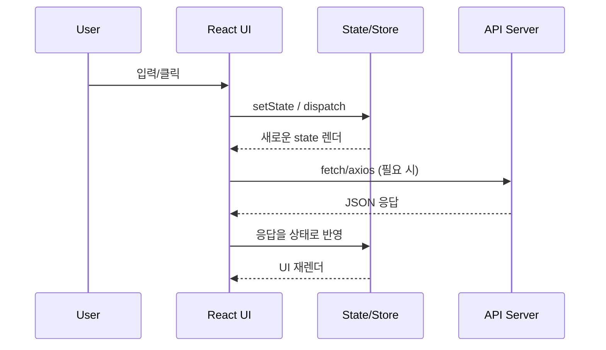
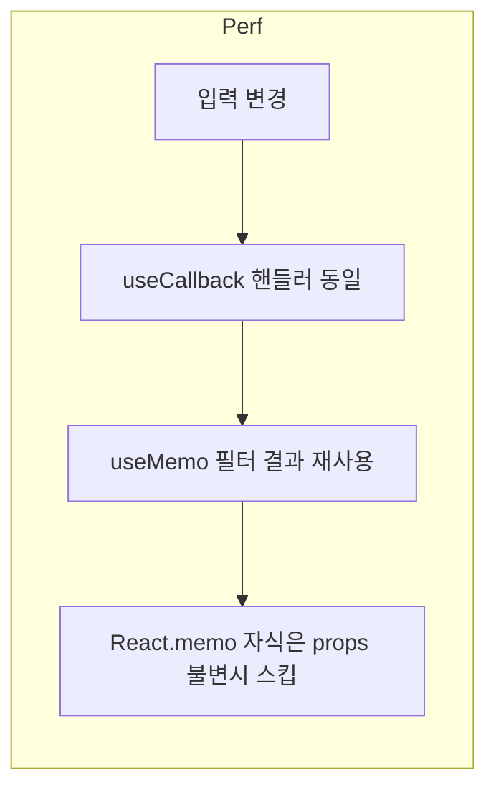

# 실무 React 코드 학습 계획

안녕하세요! 미래의 멋진 React 개발자 여러분!

이 학습 계획은 여러분이 단순한 문법 지식을 넘어, 실제 프로젝트에서 마주하게 될 상황에 대비하여 견고하고 유지보수하기 쉬운 React 애플리케이션을 구성하는 데 필요한 핵심 역량을 길러주기 위해 기획되었습니다. 각 단계에서 제시하는 '나쁜 예시'를 통해 흔히 저지르는 실수를 파악하고, '좋은 예시'를 통해 모범 사례와 그 배경에 있는 원칙을 깊이 있게 이해하는 것이 중요합니다.

각 학습 주제는 상세한 설명과 코드 예시를 포함하며, '왜', '어떤 상황에서', '이 해당 패턴을 사용해야 하는지'를 깊이 있게 이해하는 학습이 되도록 합니다. 주도적인 학습을 위해 직접 예시 코드를 실행해보고, 나쁜 코드를 좋은 코드로 리팩토링하는 연습을 해볼 것을 강력히 추천합니다! 모든 학습 과정을 성공적으로 마치고 나면, 여러분은 자신감 넘치는 개발자로 성장해 있을 것입니다. 자, 그럼 시작해볼까요!

---

```mermaid
flowchart LR
  A[Step1 기본개념] --> B[Step2 Hooks]
  B --> C[Step3 라이프사이클(useEffect)]
  C --> D[Step4 이벤트]
  D --> E[Step5 조건/리스트]
  E --> F[Step6 폼]
  F --> G[Step7 전역상태]
  G --> H[Step8 라우터]
  H --> I[Step9 데이터패칭]
  I --> J[Step10 성능/테스트]
```



### **학습 로드맵**

| 단계 | 주제 | 학습 목표 | 상태 |
| :-- | :--- | :--- | :--- |
| **Step 1** | **React 기본 개념** | JSX, 컴포넌트, Props, State 등 React 핵심 개념 이해 | 완료 |
| **Step 2** | **함수형 컴포넌트와 Hooks** | `useState`, `useEffect`, `useContext` 등 Hooks 사용법 학습 | 완료 |
| **Step 3** | **컴포넌트 라이프사이클** | 함수형 컴포넌트에서 `useEffect`를 이용한 라이프사이클 관리 | 완료 |
| **Step 4** | **이벤트 핸들링** | React에서 이벤트 처리 방식 및 합성 이벤트 이해 | 완료 |
| **Step 5** | **조건부 렌더링과 리스트 렌더링** | `if/else`, 삼항 연산자, `map` 등을 이용한 조건부/리스트 렌더링 | 완료 |
| **Step 6** | **폼 다루기** | 제어 컴포넌트와 비제어 컴포넌트를 이용하여 사용자 입력 처리 | 완료 |
| **Step 7** | **상태 관리 (Context API, Redux/Zustand)** | Context API 또는 Redux/Zustand를 이용한 전역 상태 관리 | 완료 |
| **Step 8** | **React Router** | SPA 구현을 위한 React Router 설정 및 동적 라우트 | 완료 |
| **Step 9** | **데이터 가져오기 (Fetch, Axios, React Query)** | 서버에서 데이터 가져오기 및 상태 관리 라이브러리 활용 | 완료 |
| **Step 10** | **성능 최적화 및 테스트** | `React.memo`, `useCallback`, `useMemo` 등 성능 최적화 기법 및 테스트 전략 | 완료 |

---

### **각 단계별 상세 내용 (예시)**

#### **Step 1: React 기본 개념**
- **나쁜 예시**: JSX 안에 직접 DOM 조작 코드를 작성하거나, 컴포넌트 간에 props 없이 전역 변수를 공유합니다.
- **좋은 예시**: JSX 문법을 사용하여 선언적으로 UI를 구성하고, props를 통해 데이터를 단방향으로 전달하여 컴포넌트의 재사용성을 높입니다.

---

### 성능 체크리스트 & 실행 예시
- 렌더 최소화: `React.memo`로 값/props 변동이 없을 때 재렌더 방지.
- 핸들러 메모이제이션: 리스트 아이템에 넘기는 콜백은 `useCallback`으로 감싸기.
- 값 계산 메모이제이션: 무거운 계산은 `useMemo`로 캐싱.
- 리스트 key: 데이터의 고유 id 사용, 인덱스 사용은 지양.
- 네트워크: SWR/React Query로 캐싱·중복요청 방지.

```jsx
// useCallback + useMemo 예시
import { useCallback, useMemo, useState } from "react";

function PriceList({ items }) {
  const [keyword, setKeyword] = useState("");
  const filtered = useMemo(
    () => items.filter((it) => it.name.includes(keyword)),
    [items, keyword]
  );
  const handleChange = useCallback((e) => setKeyword(e.target.value), []);

  return (
    <>
      <input value={keyword} onChange={handleChange} />
      <ul>
        {filtered.map((it) => (
          <li key={it.id}>{it.name}: {it.price}</li>
        ))}
      </ul>
    </>
  );
}
```

### 코드 스플리팅/지연 로딩 예시
```jsx
import { Suspense, lazy } from "react";
const Chart = lazy(() => import("./Chart")); // 번들 분리

export default function Dashboard() {
  return (
    <div>
      <h1>Dashboard</h1>
      <Suspense fallback={<p>Loading chart...</p>}>
        <Chart />
      </Suspense>
    </div>
  );
}
```

### 데이터 패칭 + 캐싱(SWR) 예시
```jsx
import useSWR from "swr";
const fetcher = (url) => fetch(url).then((r) => r.json());

function UserList() {
  const { data, error, isLoading } = useSWR("/api/users", fetcher, { refreshInterval: 30000 });
  if (isLoading) return <p>Loading...</p>;
  if (error) return <p>에러 발생</p>;
  return (
    <ul>
      {data.map((u) => (
        <li key={u.id}>{u.name}</li>
      ))}
    </ul>
  );
}
```



### Lighthouse/Profiler 활용 가이드 (요약)
1) **React Profiler**: DevTools → Profiler 탭 → “Record” 후 상호작용 → 재렌더 시간 긴 컴포넌트 확인.  
2) **Lighthouse**: Chrome DevTools → Lighthouse → Performance/Best Practices 체크 → “Generate Report”.  
3) **즉시 개선 포인트**:  
   - CLS: 이미지에 width/height 지정, 레이아웃 시프트 최소화.  
   - TTI: 불필요한 스크립트 지연 로딩, 코드 스플리팅 확대.  
   - TBT: 무거운 동기 연산을 Web Worker로 이동.

### 코드 스플리팅 실전 시나리오 (페이지 단위)
```jsx
import dynamic from "next/dynamic";
const AdminPanel = dynamic(() => import("./AdminPanel"), { suspense: true });

export default function Page() {
  return (
    <Suspense fallback={<p>Loading admin...</p>}>
      <AdminPanel />
    </Suspense>
  );
}
```

### Web Vitals 로그 예시
```js
export function reportWebVitals(metric) {
  // metric: { id, name, startTime, value, label }
  fetch("/vitals", {
    method: "POST",
    body: JSON.stringify(metric),
    keepalive: true,
    headers: { "Content-Type": "application/json" },
  });
}
```
- **학습 포인트**: React는 선언적 UI와 컴포넌트 기반 아키텍처를 통해 효율적인 웹 애플리케이션 개발을 지원합니다. JSX, Props, State의 개념을 명확히 이해하고 올바르게 사용하는 것이 중요합니다.

---

### **생성될 React 파일 목록**

`c:/Users/Nam/Documents/Cursor/Workspace/origin/learning-code/react` 경로에 다음 파일들이 생성될 예정입니다. 이 파일들은 나쁜 예시와 좋은 예시 코드를 포함하며, 상세한 주석을 통해 각 패턴을 심층적으로 학습할 수 있도록 구성될 것입니다.

```
learning-code/react/
├── Step1_ReactBasicConcepts.js
├── Step2_FunctionalComponentsAndHooks.js
├── Step3_ComponentLifecycle.js
├── Step4_EventHandling.js
├── Step5_ConditionalAndListRendering.js
├── Step6_HandlingForms.js
├── Step7_StateManagement.js
├── Step8_ReactRouter.js
├── Step9_FetchingData.js
├── Step10_PerformanceOptimizationAndTesting.js
```

---

### **추가 학습 권장 사항**

| 주제 | 설명 | 난이도 |
|:-----|:-----|:------:|
| **Next.js** | React 기반 풀스택 프레임워크로, SSR, SSG, API Routes 등 프로덕션 레벨 기능을 학습합니다. | 중급 |
| **React Server Components** | 서버에서 렌더링되는 컴포넌트로, 번들 크기 감소와 성능 향상을 위한 최신 패턴을 익힙니다. | 중급 |
| **테스트 (React Testing Library, Cypress)** | 컴포넌트 단위 테스트와 E2E 테스트를 통한 안정적인 React 애플리케이션 개발을 학습합니다. | 중급 |
| **애니메이션 (Framer Motion, React Spring)** | 부드럽고 자연스러운 UI 애니메이션을 구현하는 라이브러리 활용법을 익힙니다. | 고급 |
| **마이크로 프론트엔드** | 대규모 React 애플리케이션을 독립적인 모듈로 분리하여 개발/배포하는 아키텍처를 학습합니다. | 고급 |
