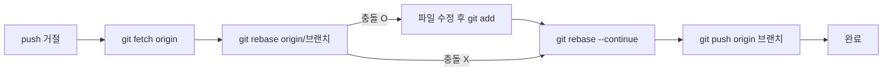
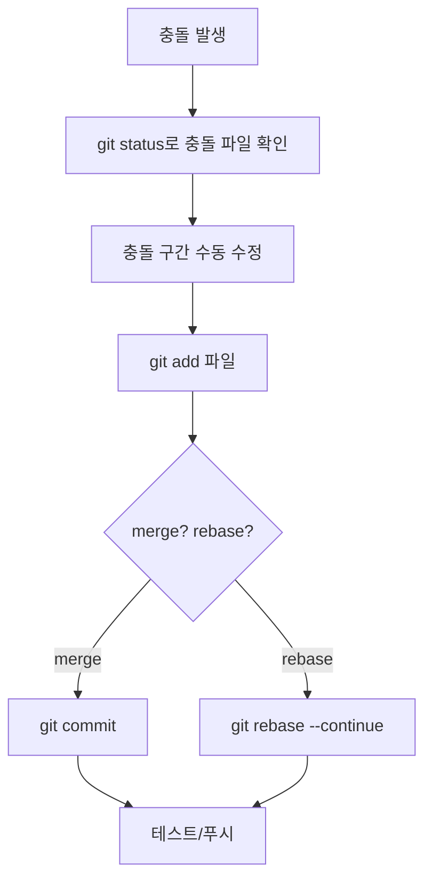
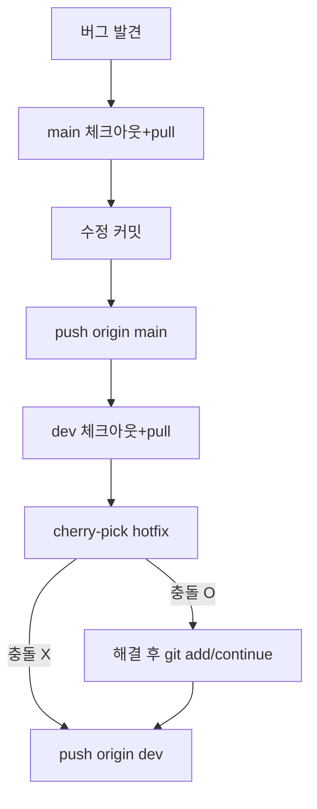
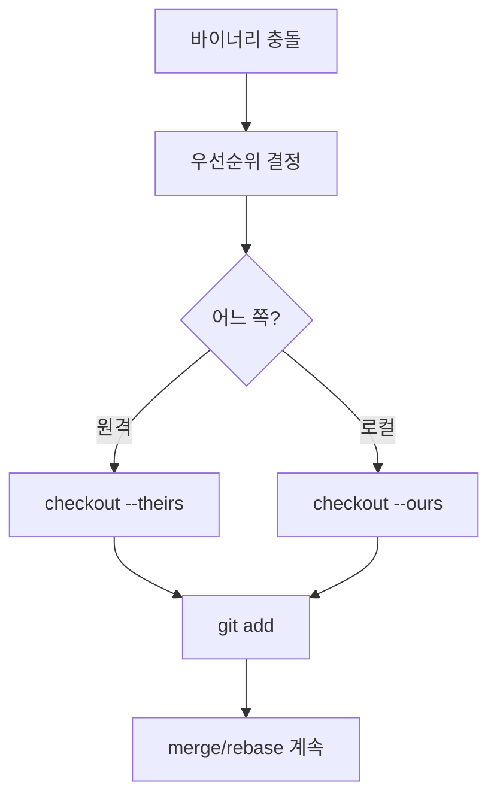
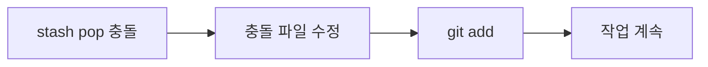
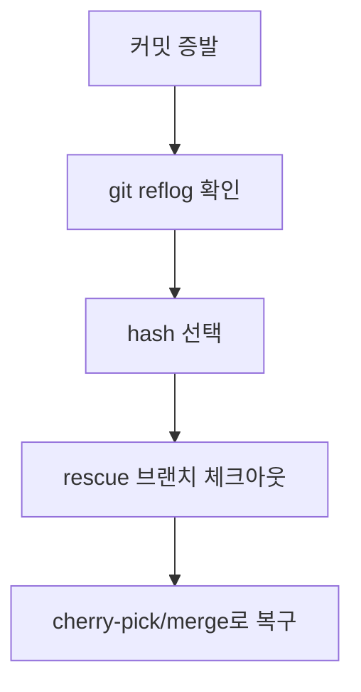
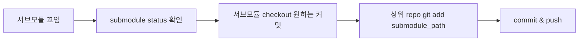

# Git 실무 시나리오 & 해결 흐름 (Flow 포함)
> 초보자도 따라 할 수 있도록 **상황 → 증상 → 목표 → 단계별 명령어 → 결과** 순서로 정리했습니다.  
> 각 시나리오는 Mermaid 플로우차트로 시각화했습니다.

## 0. 공통 원칙 (빠르게 체크)
- `git status -sb` 로 상태를 먼저 본다.  
- 충돌/문제 발생 시 **reset 대신 stash/branch 복사**로 안전하게 작업한다.  
- 기록이 날아가도 `git reflog` 로 대부분 복구 가능하다.

---

## 시나리오 1) 원격 선행 커밋 때문에 push 거절 (non-fast-forward)
- **증상**: `git push` 시 `rejected (non-fast-forward)` 메시지.
- **목표**: 내 커밋을 원격 최신 커밋 위에 재적용하고 푸시.
- **단계**
  1) 상태 확인: `git status -sb`
  2) 원격 최신 반영: `git fetch origin`
  3) 리베이스: `git rebase origin/<브랜치>`
  4) 충돌 나면 파일 수정 → `git add <파일>` → `git rebase --continue`
  5) 완료 후 푸시: `git push origin <브랜치>`
- **플로우**


| 명령 | 기대 출력/효과 | 흔한 실수 |
| --- | --- | --- |
| `git fetch origin` | 원격 최신 참조를 로컬로 가져옴 | 생략 후 바로 rebase/push 시 충돌·거절 |
| `git rebase origin/<branch>` | 내 커밋을 최신 기반 위로 재배치 | 충돌 해결 후 `git add` 없이 `--continue` 실행 |
| `git push origin <branch>` | 원격 업데이트 | 뒤쳐진 상태에서 `--force`로 덮어쓰기 |

---

## 시나리오 2) 소스 파일 머지 충돌 해결 (기능 브랜치 ↔ main)
- **증상**: `git merge` 또는 `git rebase` 중 소스 충돌.
- **목표**: 원하는 쪽 내용으로 병합하고 기록 정리.
- **단계**
  1) 충돌 파일 확인: `git status` (충돌 난 파일 `UU` 표시)
  2) 에디터에서 `<<<<<<< HEAD` 구간을 원하는 내용으로 수동 정리
  3) 수정 후 저장: `git add <파일>`
  4) 머지면 `git commit`, 리베이스면 `git rebase --continue`
  5) 테스트 후 푸시: `git push`
- **플로우**


| 명령 | 기대 출력/효과 | 흔한 실수 |
| --- | --- | --- |
| `git status` | 충돌 파일(UU) 목록 안내 | status를 안 보고 파일 누락 |
| `git checkout --theirs <파일>` | 상대/원격 변경으로 덮어쓰기 | 필요한 내 변경까지 덮어씀 |
| `git checkout --ours <파일>` | 내 변경 유지 | 최신 원격 수정 사라짐 |
| `git add <파일>` | 충돌 해결 완료 표시 | add 없이 `--continue` 시도 |
| `git rebase --continue` | 다음 커밋 처리 | 메시지 수정 시점 혼동 |

---

## 시나리오 3) 대규모 리팩터링/파일 이동 후 리뷰 쉽게 만들기
- **증상**: 코드 대이동으로 PR diff 가 커서 리뷰어가 보기 힘듦.
- **목표**: 의미 있는 단계로 나눠 커밋/PR 정리.
- **단계**
  1) **파일 이동만** 먼저 커밋: `git mv ...` → `git commit -m "chore: move files"`
  2) 내용 수정은 별도 커밋: `git add ...` → `git commit -m "refactor: ..."`
  3) push 후 PR에 두 커밋을 유지하거나 `--no-ff` merge 사용.
- **플로우**


| 명령 | 기대 출력/효과 | 흔한 실수 |
| --- | --- | --- |
| `git mv ...` | 이동만 포함된 커밋 | 이동+수정 한 번에 해서 diff 폭증 |
| 이동/수정 커밋 분리 | 리뷰·blame 명확 | 포매터로 전체 파일 변경 → 이동 커밋 오염 |

---

## 시나리오 4) 운영 긴급 핫픽스 (main에 바로 반영, dev에도 반영 필요)
- **증상**: 프로덕션 버그 → main에 즉시 패치, 이후 dev도 동일 반영 필요.
- **목표**: main에 핫픽스 커밋 후 dev에 동일 변경 적용(cherry-pick).
- **단계**
  1) `git checkout main && git pull --rebase`
  2) 수정 후 커밋: `git commit -am "fix: hotfix ..."`
  3) 배포용 푸시: `git push origin main`
  4) 개발 브랜치로 이동: `git checkout dev && git pull --rebase`
  5) 메인 커밋 체리픽: `git cherry-pick <hotfix_hash>`
  6) 충돌 해결 후 `git push origin dev`
- **플로우**


---

## 시나리오 5) 실수로 main에 직접 커밋/푸시
- **증상**: 보호된 main에 잘못 커밋/푸시 함.
- **목표**: 히스토리 정리 및 올바른 브랜치로 이동.
- **단계 (이미 푸시됨, 협업 환경)**  
  1) 되돌림 커밋 생성: `git revert <잘못된커밋>`  
  2) `git push origin main`  
  3) 새 브랜치 생성 후 동일 변경 재적용(필요 시 cherry-pick):  
     `git checkout -b feature/fix` → `git cherry-pick <잘못된커밋>`  
  4) 정상 절차로 PR 생성.
- **플로우**
```mermaid
flowchart LR
  A[main에 실수 커밋] --> B[git revert 커밋]
  B --> C[push main]
  C --> D[새 브랜치 생성]
  D --> E[cherry-pick (선택)]
  E --> F[PR 제출]
```

---

## 시나리오 6) 바이너리/대용량 파일 충돌 (디자인 산출물, psd 등)
- **증상**: 텍스트 머지 불가, 충돌 해결 난이도 높음.
- **목표**: 올바른 버전 선택 후 기록.
- **단계**
  1) 두 버전 비교가 어렵다면, 결정 우선순위 정함(디자이너/최신 산출물 등).
  2) 원하는 쪽 선택:  
     - 원격 버전 사용: `git checkout --theirs path/to/file`  
     - 내 로컬 버전 사용: `git checkout --ours path/to/file`
  3) 스테이징: `git add path/to/file`
  4) 머지/리베이스 계속 진행.
- **플로우**


---

## 시나리오 7) stash pop 중 충돌
- **증상**: `git stash pop` 후 충돌.
- **목표**: 충돌 해결 및 stash 기록 정리.
- **단계**
  1) 충돌 파일 확인: `git status`
  2) 일반 충돌과 동일하게 수정 → `git add <파일>`
  3) `git stash drop` 은 pop이 이미 수행하면 자동 처리되므로 추가 drop 불필요.
- **플로우**


---

## 시나리오 8) 작업 날려먹음? → reflog로 복구
- **증상**: reset/force-push 등으로 커밋이 사라진 듯 보임.
- **목표**: 이전 HEAD를 찾아 복구.
- **단계**
  1) `git reflog` 로 이전 HEAD 위치 확인.
  2) 돌아가고 싶은 지점 선택: `git checkout -b rescue <hash>`
  3) 필요한 커밋을 정상 브랜치에 cherry-pick 또는 merge.
- **플로우**


---

## 시나리오 9) 서브모듈 업데이트 충돌/버전 꼬임
- **증상**: 서브모듈 경로에 변경이 꼬여 빌드 실패.
- **목표**: 의도한 커밋으로 서브모듈 고정.
- **단계**
  1) 현재 포인터 확인: `git submodule status`
  2) 원하는 커밋으로 이동:  
     `cd submodule_path && git fetch && git checkout <commit>`
  3) 상위 리포에 포인터 기록:  
     `cd .. && git add submodule_path && git commit -m "chore: bump submodule"`
- **플로우**


---


| 명령 | 기대 출력/효과 | 흔한 실수 |
| --- | --- | --- |
| git reflog | HEAD 이동 기록 확인 | reflog 보존기간(기본 90일) 경과해 복구 불가 |
| git checkout -b rescue <hash> | 안전 복구용 브랜치 확보 | hash 오타로 엉뚱한 커밋 복구 |
| git cherry-pick <hash> | 특정 커밋만 선택 적용 | 충돌 처리 후 --continue 잊음 |
| git merge | 브랜치 통합 | --no-ff 여부, 대상 브랜치 착각 |

## 마무리 체크리스트
- 충돌 해결 후 `git status` 가 깨끗한지 확인.
- 중요한 브랜치(main/prod)는 보호 규칙(직접 푸시 금지, PR 필수) 적용.
- 문제가 생기면 **branch 분기 + reflog**가 안전한 첫 대응이다.
