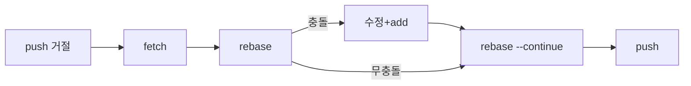
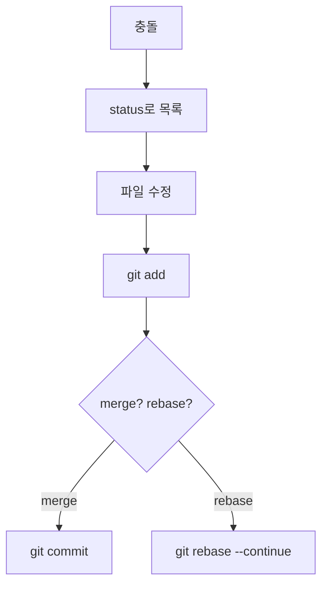
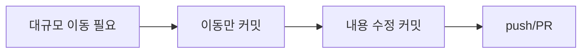
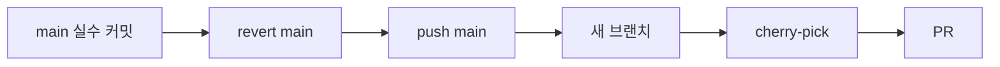
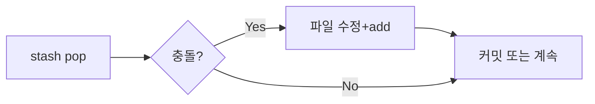

# Step5: Git 실무 시나리오 모음 (문제 해결 중심)
> 복사-붙여넣기 가능한 순서형 명령과 간단한 Mermaid 다이어그램을 제공합니다.  
> CLI 기준으로 설명하되, 필요한 곳에 GUI 팁을 덧붙였습니다.

## 목차
1. 공통 체크리스트
2. push 거절(non-fast-forward) 해결
3. 머지·리베이스 충돌 처리
4. 대규모 리팩터링 diff 최소화(이동·수정 분리)
5. 프로덕션 핫픽스 후 dev 반영
6. main에 잘못 올린 커밋 복구 후 새 브랜치에 적용
7. stash pop 충돌 처리
8. reflog로 날아간 커밋 복구
9. 바이너리/대용량 충돌 처리
10. 서브모듈 꼬임 해결
11. 큰 변경을 안전하게 쪼개 커밋하기(부분 스테이징)
12. 요약 체크리스트

---

## 1. 공통 체크리스트
```bash
git status -sb
git config --get user.name && git config --get user.email
git remote -v
```
> TIP: 충돌·rebase 중 `git status`가 다음 액션을 안내합니다.

---

## 2. push 거절 (non-fast-forward) 해결
```bash
git status -sb
git fetch origin
git rebase origin/<브랜치명>   # 최신 위에 재적용
# 충돌 시: 파일 수정 → git add <파일> → git rebase --continue
git push origin <브랜치명>
```

> GUI: VS Code Source Control → “Pull (Rebase)” → 충돌 파일 정리 후 “Stage” → “Continue Rebase”.

---

## 3. 머지·리베이스 충돌 처리
```bash
git status                      # UU 파일 확인
# 에디터에서 <<<<<<< >>>>>>> 마커 정리
git add <파일>
git commit            # 머지 중
git rebase --continue # 리베이스 중
```

> TIP: 많이 얽히면 `git checkout --theirs <file>` / `--ours`로 기준을 먼저 정하고 필요한 부분만 재수정.

---

## 4. 대규모 리팩터링 diff 최소화 (이동·수정 분리)
```bash
# 1) 이동만 커밋
git mv src/foo.js src/legacy/foo.js
git commit -m "chore: move foo"
# 2) 내용 수정 커밋
git add src/legacy/foo.js
git commit -m "refactor: update foo logic"
# 3) 두 커밋 유지 후 PR
git push origin <브랜치>
```


---

## 5. 프로덕션 핫픽스 후 dev 반영
```bash
git checkout main
git pull --rebase
# 수정 후
git commit -am "fix: hotfix ..."
git push origin main

git checkout dev
git pull --rebase
git cherry-pick <main핫픽스커밋>
# 충돌 시 정리 후 add → cherry-pick --continue
git push origin dev
```

---

## 6. main에 잘못 올린 커밋 복구 후 새 브랜치에 적용
```bash
git checkout main
git revert <실수커밋해시> --no-edit
git push origin main

git checkout -b feature/fix-from-main
git cherry-pick <실수커밋해시>
git push origin feature/fix-from-main
# 이제 PR 생성
```


---

## 7. stash pop 충돌 처리
```bash
git stash pop
# 충돌 시
git status
# 파일 수정 후
git add <파일>
# 머지가 아니므로 필요하면 바로 commit, 아니면 계속 작업
```


---

## 8. reflog로 날아간 커밋 복구
```bash
git reflog                          # 사라진 HEAD 기록 확인
git checkout -b rescue <해시>       # 안전 복구 브랜치
git checkout <원브랜치>
git cherry-pick <해시>              # 필요한 커밋만 가져오기
```

---

## 9. 바이너리/대용량 파일 충돌 처리
```bash
git checkout --theirs path/to/file  # 원격 버전 선택
git checkout --ours   path/to/file  # 로컬 버전 선택
git add path/to/file
# 이후 merge/rebase 계속
```

---

## 10. 서브모듈 꼬임 해결
```bash
git submodule status
cd submodule_path
git fetch
git checkout <원하는커밋>
cd ..
git add submodule_path
git commit -m "chore: bump submodule"
git push origin <브랜치>
```

---

## 11. 큰 변경을 안전하게 쪼개 커밋하기 (부분 스테이징)
```bash
git add -p              # hunk 단위 선택
# 필요하면 'e'로 수동 편집해 일부 줄만 stage
git commit -m "feat: ..."
# 반복해서 작은 커밋 여러 개 생성
```
> TIP: 리뷰와 롤백이 쉬워지고, 테스트 실패 시 bisect가 빨라집니다.

---

## 12. 요약 체크리스트
- push 거절: fetch → rebase → push  
- 충돌: status로 범위 확인 → 수정 → add → commit/rebase --continue  
- 대규모 변경: 이동 커밋과 내용 커밋을 분리  
- 잘못 올린 커밋: main에서 revert, 새 브랜치에 cherry-pick  
- 복구: 새 브랜치 + reflog 조합이 가장 안전  
- 부분 스테이징: `git add -p`, 강제푸시는 `--force-with-lease` 사용
