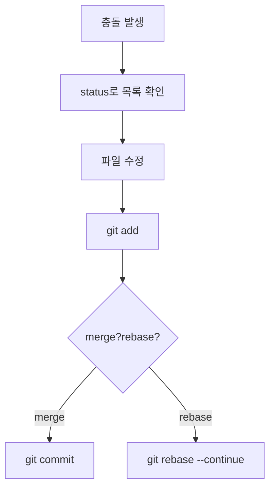
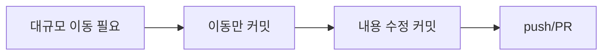
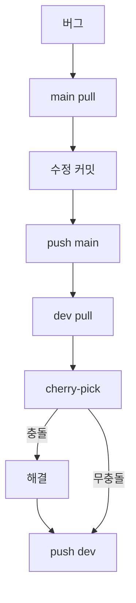
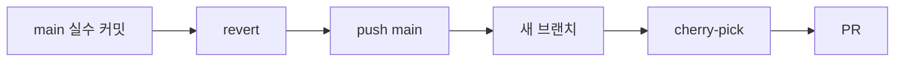
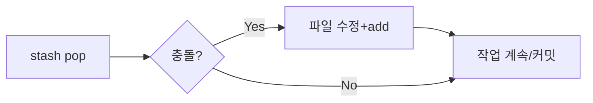
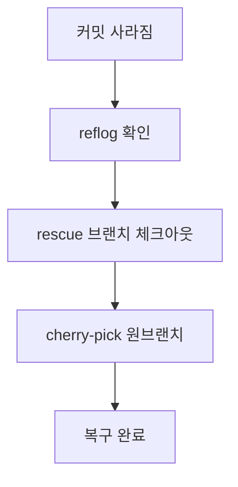
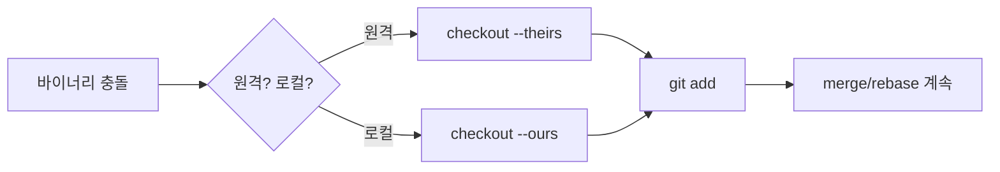
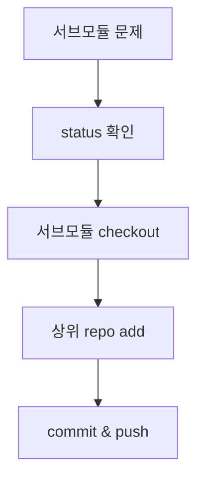

# Git CLI 실무 시나리오 모음 (초보자용, 명령어 중심)
> 모든 예시는 UTF-8 한글 주석을 포함했고, 초보자가 **그대로 복사-붙여넣기**해도 되도록 순서를 명확히 적었습니다.  
> 각 시나리오에는 Mermaid 플로우차트가 포함되어 있어 흐름을 한눈에 볼 수 있습니다.

## 공통 단축 확인
```bash
git status -sb          # 간단 상태표시 (추천)
git config --get user.name && git config --get user.email
```

---

## 1) push 거절 (non-fast-forward) 해결
```bash
# 1. 상태 확인
git status -sb

# 2. 원격 최신 반영
git fetch origin

# 3. 내 브랜치를 원격 위로 재적용
git rebase origin/<브랜치명>

# 4. 충돌 시: 파일 열어 정리 후
git add <충돌해결한파일>
git rebase --continue

# 5. 성공 후 푸시
git push origin <브랜치명>
```


---

## 2) 머지/리베이스 충돌 빠르게 풀기
```bash
git status                # 충돌 파일 목록(UU) 확인
# 에디터로 <<<<<<< 구간을 원하는 내용으로 수정
git add <파일>
# 머지 중이면
git commit
# 리베이스 중이면
git rebase --continue
```


---

## 3) 대규모 리팩터링 diff 줄이기(이동과 수정 분리)
```bash
# 1) 이동만 커밋
git mv src/foo.js src/legacy/foo.js
git commit -m "chore: move foo"

# 2) 내용 수정 커밋
git add src/legacy/foo.js
git commit -m "refactor: update foo logic"

# 3) push 후 PR 두 커밋 그대로 유지(리뷰어 친절)
git push origin <브랜치>
```


---

## 4) 프로덕션 긴급 핫픽스 + dev 반영
```bash
# main에서 핫픽스
git checkout main
git pull --rebase
# 수정 후
git commit -am "fix: hotfix ..."
git push origin main

# dev에도 동일 반영
git checkout dev
git pull --rebase
git cherry-pick <main핫픽스커밋해시>
# 충돌 시 해결 후 add/continue
git push origin dev
```


---

## 5) main에 잘못 푸시했을 때 되돌리기(협업 안전모드)
```bash
# 1. 되돌림 커밋 만들기 (히스토리 보존)
git revert <잘못된커밋>
git push origin main

# 2. 새 브랜치에 동일 변경 적용하고 정상 PR
git checkout -b feature/fix-from-main
git cherry-pick <잘못된커밋>
git push origin feature/fix-from-main
# → 이제 PR 생성
```


---

## 6) stash pop 충돌
```bash
git stash pop
# 충돌 시
git status
# 파일 수정 후
git add <파일>
# 리베이스가 아니므로 commit 또는 계속 작업
```


---

## 7) Reflog로 날아간 커밋 살리기
```bash
git reflog                 # 사라진 HEAD 기록 보기
git checkout -b rescue <원하는해시>   # 안전 복구 브랜치
# 필요 커밋을 원래 브랜치에 cherry-pick
git checkout <원브랜치>
git cherry-pick <해시>
```


---

## 8) 바이너리/대용량 파일 충돌 처리
```bash
# 원격 버전 선택
git checkout --theirs path/to/file
# 로컬 버전 선택
git checkout --ours path/to/file
git add path/to/file
# 머지/리베이스 계속
```


---

## 9) 서브모듈 꼬임 해결
```bash
git submodule status
cd submodule_path
git fetch
git checkout <원하는커밋>
cd ..
git add submodule_path
git commit -m "chore: bump submodule"
git push origin <브랜치>
```


---

## 10) 큰 변경을 안전하게 쪼개 커밋하기 (초보 필수 습관)
```bash
# 1) 기능 단위로 stage/commit
git add -p          # 변경을 hunk 단위로 선택
git commit -m "feat: ~"   # 작은 단위 커밋

# 2) 테스트 후 push
git push origin <브랜치>
```


---

## 체크리스트
- `git status -sb` 가 깨끗한지 항상 확인.
- main/prod는 직접 푸시 대신 PR 사용(보호 규칙 설정 권장).
- 문제가 생기면 **새 브랜치 + reflog** 조합이 가장 안전한 복구 루트.
